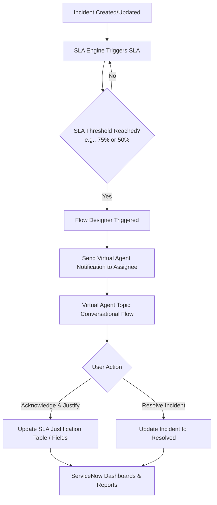

# Virtual Agent–Driven SLA Breach Awareness & Justification System

This project aims to improve SLA governance by integrating ServiceNow Virtual Agent capabilities with SLA monitoring and justification tracking. The solution proactively notifies assignees before an SLA breach, captures acknowledgements and justifications, and provides management with meaningful reports and dashboards—all by leveraging native ServiceNow Administration features without custom scripting.

---

## Proposed Solution Architecture (ServiceNow Native)

To meet the business objectives without custom scripting, we will utilize the following native ServiceNow capabilities:

### 1. Data Model & Schema Design
We will define a custom table or extend existing tables to store acknowledgements and justifications in an audit-ready format.
* **Option A: Custom Table (`u_sla_breach_justification`)**
  * `u_incident` (Reference -> Incident)
  * `u_task_sla` (Reference -> Task SLA)
  * `u_assignee` (Reference -> Sys User)
  * `u_acknowledged` (Boolean)
  * `u_acknowledgement_time` (Date/Time)
  * `u_justification_category` (Choice: *Awaiting Customer*, *Awaiting Vendor*, *Complex Troubleshooting*, *Resource Constraint*, *Other*)
  * `u_justification_details` (String/Text)
* **Option B: Task SLA Table Extension**
  * Add custom fields directly to the `task_sla` table using ServiceNow Form Designer.

### 2. Proactive Alerting (Flow Designer)
* **Trigger**: A trigger based on the `SLA percentage` field in the `task_sla` table (e.g., `SLA percentage is 75%` and `Stage is In Progress`).
* **Actions**:
  * Identify the assignee from the associated Incident.
  * Trigger a **Virtual Agent Notification** targeting the assignee.

### 3. Conversational Interface (Virtual Agent Topic)
Using **Virtual Agent Designer**, we will build a conversational flow:
1. **Greeting/Alert**: "Hello [Name], Incident [INCXXXXXX] is at [75%] of its SLA. It is estimated to breach in [Time remaining]."
2. **User Input (Prompt)**: Provide two options:
   * **[Acknowledge & Justify]**
   * **[I'm working on it / Resolve Now]**
3. **Justification Selection**: If they choose to justify, present a choice list of reasons:
   * *Awaiting Customer Action*
   * *Awaiting Third-Party Vendor*
   * *Complex Technical Investigation*
   * *Resource Constraint / High Workload*
   * *Other*
4. **Free-text Input**: If *Other* or as an optional follow-up, prompt: "Please provide any additional details."
5. **Update Record**: Use the native **Update Record** action in the Virtual Agent flow to save these details to the `u_sla_breach_justification` table.

### 4. Reporting & Dashboards
Create a ServiceNow Dashboard containing:
* **SLA Breach Risk Heatmap**: Open incidents nearing breach.
* **Justification Breakdown**: Pie chart of justification categories.
* **Pending Justifications**: List of breached SLAs without submitted justifications.
* **Assignee Accountability Score**: Percentage of SLAs acknowledged vs. missed.

---

## Delivery Options

Since we are working in a local development environment, we have two ways to proceed:

### Option 1: Detailed Configuration & Design Document (ServiceNow Blueprints)
We will generate a complete set of XML update-set-compatible specifications, Flow Designer step-by-step blueprints, Virtual Agent topic design maps, and Dashboard configuration guides. This is ideal if you want to copy-paste the exact configuration steps into your ServiceNow Personal Developer Instance (PDI).

### Option 2: Interactive Web Prototype (Highly Recommended)
We will build a high-fidelity, premium web application that simulates both sides of this system:
1. **Assignee Portal & Virtual Agent Simulator**: A beautiful, interactive chat interface where you can simulate receiving the SLA warning, chatting with the Virtual Agent, selecting justifications, and seeing the status update.
2. **Manager Dashboard**: A real-time dashboard showing SLA metrics, breach trends, justification charts, and incident lists.
3. **Incident Generator**: A control panel to trigger mock incidents and see them show up in the SLA queue.

---

## User Review Required

> [!IMPORTANT]
> Please review the two options above and let us know which path you would like to pursue. We recommend **Option 2 (Interactive Web Prototype)** as it will allow you to interactively experience and demonstrate the system's workflow, aesthetics, and dashboards directly.

> [!NOTE]
> If you choose Option 2, we will create a dedicated project folder under `C:\Users\ADMIN\.gemini\antigravity\scratch\sla-justification-system` and implement it using a modern, highly aesthetic UI.

---

## Open Questions

1. **Thresholds**: What warning thresholds should trigger the Virtual Agent alert? (e.g., 50%, 75%, 90%?)
2. **Escalation**: Should the Virtual Agent notify the assignment group manager if the assignee does not respond to the Virtual Agent notification within a certain timeframe?
3. **Justification Categories**: Are the proposed justification categories sufficient, or should we include others?

---

## Verification Plan

### Manual Verification (For Option 2 Prototype)
* **Step 1**: Open the Web Prototype.
* **Step 2**: Generate a mock incident and set it to a warning state (e.g., 75% SLA).
* **Step 3**: Verify that a Virtual Agent chat notification appears for the assignee.
* **Step 4**: Complete the Virtual Agent flow, select a justification, and submit.
* **Step 5**: Navigate to the Manager Dashboard and verify that the justification is recorded, the charts update, and the incident is marked as "Justified".
