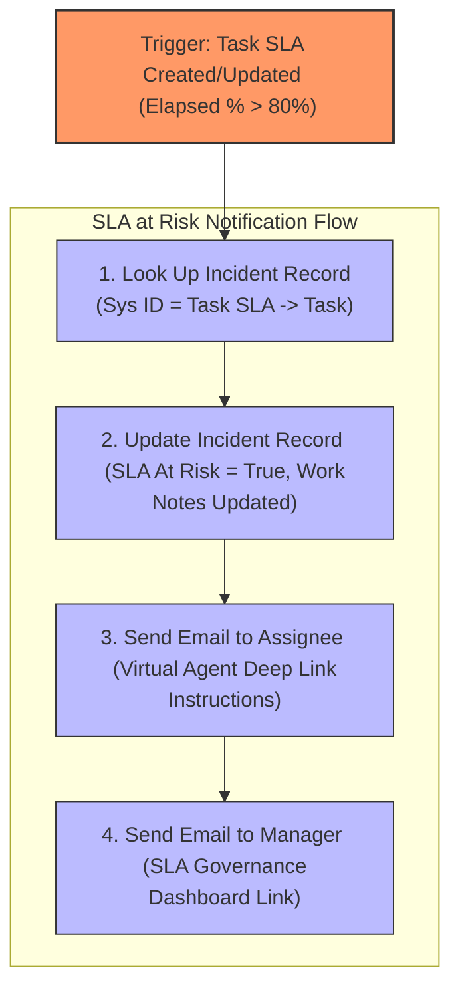

# Task 10: Create a Flow for Notification

## Project Title

**Virtual Agent–Driven SLA Breach Awareness & Justification System**

---

# Introduction

Flow Designer is a low-code automation tool in ServiceNow that enables administrators to automate business processes without scripting. In this project, a flow is created to automatically notify the incident assignee and their manager when an Incident SLA reaches 80% of its allocated time.

The flow updates the Incident record, marks it as "SLA At Risk", adds work notes, and sends notification emails to ensure timely action before an SLA breach occurs.

---

# Objective

Create an automated notification flow that detects incidents approaching SLA breach and notifies the assignee and manager using ServiceNow Flow Designer.

---

# Navigation

**Process Automation → Flow Designer → New Flow**

---

# Flow Configuration

| Property | Value |
|----------|-------|
| Flow Name | SLA at Risk Notification |
| Application | Global |
| Description | Sends notification when Incident SLA reaches 80% |

---

# Flow Trigger

| Property | Value |
|----------|-------|
| Trigger | Created or Updated |
| Table | Task SLA |
| SLA Definition | Incident Resolution - Virtual Agent Governance |
| Business Elapsed Percentage | Greater than 80% |
| Run Trigger | Once |

---

# Flow Actions

## Action 1 – Look Up Record

| Property | Value |
|----------|-------|
| Action | Look Up Record |
| Table | Incident |
| Condition | Sys ID = Trigger → Task SLA → Task |

**Purpose**

Retrieve the Incident record associated with the Task SLA.

---

## Action 2 – Update Record

| Property | Value |
|----------|-------|
| Action | Update Record |
| Record | Incident Record (Look Up Record) |
| SLA At Risk | True |
| Work Notes | SLA Crossed 80%, Governance Activated |

**Purpose**

Update the Incident record by marking it as SLA At Risk and adding work notes.

---

## Action 3 – Send Email to Assignee

| Property | Value |
|----------|-------|
| Action | Send Email |
| Target Record | Incident |
| To | Assigned To → Email |
| Subject | ⚠️ SLA At Risk – Immediate Action Required – Incident Number |

### Email Body

```
Hello ${Assigned To Name},

The SLA for Incident ${Incident Number} has reached a critical threshold.

Please acknowledge the SLA risk and provide justification immediately.

Action Required

• Open Service Portal
• Click on the Virtual Agent
• Select "SLA Breach Awareness & Justification"
• Complete the guided conversation

Regards,

ServiceNow System
```

---

## Action 4 – Send Email to Manager

| Property | Value |
|----------|-------|
| Action | Send Email |
| Target Record | Incident |
| To | Assigned To → Manager → Email |
| Subject | View SLA Governance Dashboard |

### Email Body

```
Hello ${Manager Name},

The SLA for Incident ${Incident Number} has reached a critical threshold.

Please review the SLA Governance Dashboard using the link below.

Dashboard:
https://dev352797.service-now.com/$pa_dashboard.do?sysparm_dashboard=99276f650b5a230024f8ae9b37673aad&sysparm_tab=77a7ef650b5a230024f8ae9b37673a7d&sysparm_cancelable=true&sysparm_editable=false&sysparm_active_panel=false

Regards,

ServiceNow System
```

---

# Flow Execution

1. Task SLA record is created or updated.
2. Business Elapsed Percentage reaches 80%.
3. Flow triggers automatically.
4. Incident record is retrieved.
5. SLA At Risk field is set to True.
6. Work Notes are updated.
7. Notification email is sent to the Incident Assignee.
8. Notification email is sent to the Assignee's Manager.

---

# Screenshots & Visual Blueprints

### Figure 1 – Flow Designer Navigation

**Description:** Navigate to Process Automation → Flow Designer to create the flow.


---

### Figure 2 – Flow Trigger Configuration

**Description:** Set the trigger on the 'Task SLA' table for when Elapsed Percentage crosses 80%.


---

### Figure 3 – Look Up Record Action

**Description:** Configure 'Look Up Record' action to retrieve the related Incident.


---

### Figure 4 – Update Record Action

**Description:** Set the 'SLA At Risk' field to true and post an automated Work Note.


---

### Figure 5 – Send Email to Assignee

**Description:** Send email notification template containing deep links to the Assignee.


---

### Figure 6 – Send Email to Manager

**Description:** Send SLA compliance dashboard alert email to the Assignee's Manager.


---

### Figure 7 – Activated Flow Blueprint

**Description:** Sequential execution map showing the trigger and actions execution path.



---

> [!NOTE]
> *Due to image generation API rate limits, Figure 7 is represented as an exact visual logic blueprint representing the Flow execution block designer.*

---

# Expected Result

- SLA At Risk field becomes True.
- Work Notes are updated automatically.
- Assignee receives an SLA warning email.
- Manager receives dashboard notification.
- Incident is ready for Virtual Agent interaction.

---

# Benefits

- Automatic SLA monitoring.
- Immediate notification at 80% SLA usage.
- Eliminates manual follow-up.
- Improves SLA compliance.
- Proactive incident management.
- Integrates with Virtual Agent.

---

# Outcome

The SLA At Risk Notification Flow was successfully created using Flow Designer. Whenever an Incident reaches 80% of its SLA duration, the flow automatically updates the Incident, notifies the assigned user, and informs the manager, ensuring proactive SLA governance.

---

# Conclusion

The Flow Designer implementation automates SLA awareness without scripting. It improves operational efficiency, reduces SLA breaches, and integrates seamlessly with the Virtual Agent–Driven SLA Breach Awareness & Justification System.
