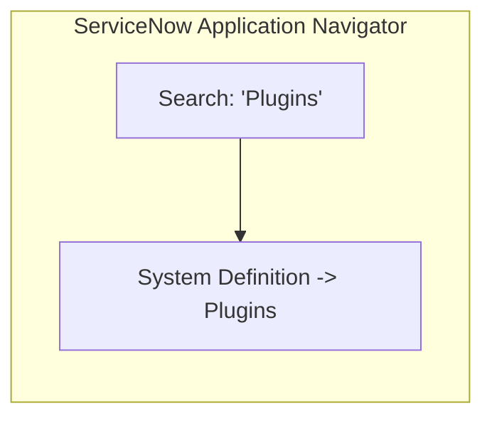
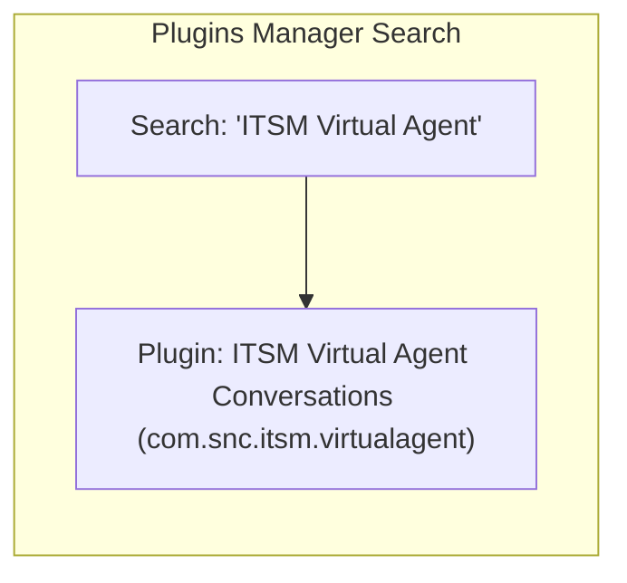
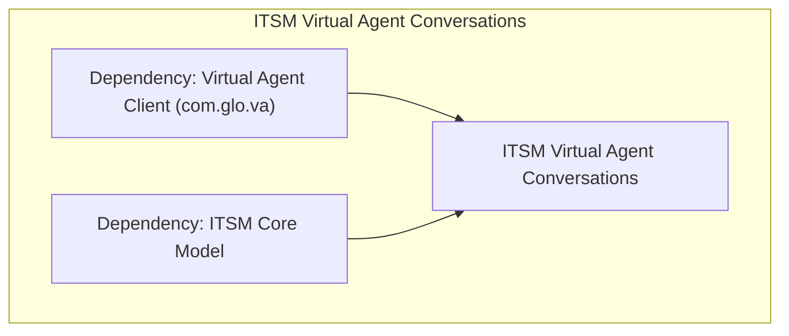
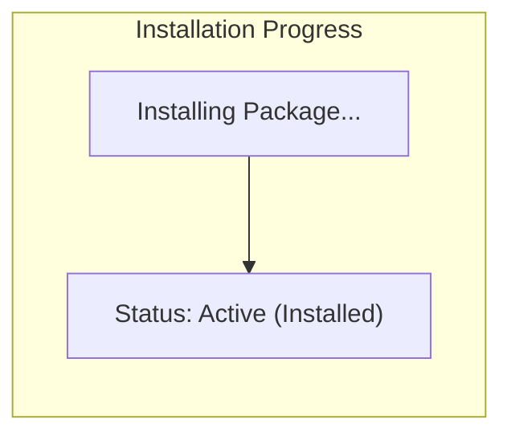

# Task 12: Install Necessary Plugins

## Project Title

**Virtual Agent–Driven SLA Breach Awareness & Justification System**

---

# Introduction

ServiceNow plugins provide additional features and capabilities that can be enabled based on project requirements. For this project, the **ITSM Virtual Agent Conversations** plugin is installed to enable Virtual Agent functionality for IT Service Management processes.

The plugin allows users to interact with the Virtual Agent, receive SLA notifications, acknowledge SLA risks, and submit SLA breach justifications through a conversational interface.

---

# Objective

Install the required Virtual Agent plugin to enable conversational interactions for SLA breach awareness and justification.

---

# Navigation

**System Definition → Plugins**

---

# Plugin Details

| Property | Value |
|----------|-------|
| Plugin Name | ITSM Virtual Agent |
| Plugin to Install | ITSM Virtual Agent Conversations |
| Status | Installed |
| Application | Global |

---

# Implementation Steps

## Step 1 – Open Plugins

1. Log in to the ServiceNow instance.
2. In the Application Navigator, search for **Plugins**.
3. Navigate to:

**System Definition → Plugins**

---

## Step 2 – Search for Plugin

1. In the Plugins page, search for:

```
ITSM Virtual Agent
```

2. Open the plugin from the search results.

---

## Step 3 – Install Plugin

1. Select **ITSM Virtual Agent Conversations**.
2. Review the plugin details.
3. Click **Install**.
4. Wait until the installation completes successfully.

---

# Verification

After installation, verify that:

- The plugin status is **Installed**.
- Virtual Agent features are available.
- Virtual Agent Designer can be accessed.
- ITSM Virtual Agent topics are available.

---

# Expected Result

- ITSM Virtual Agent Conversations plugin is installed successfully.
- Virtual Agent capabilities are enabled.
- Required components for chatbot configuration become available.

---

# Visual Blueprints & Flowcharts

### Figure 1 – Plugins Navigation

**Description:** Navigate to System Definition → Plugins in the Application Navigator.



---

### Figure 2 – Search for ITSM Virtual Agent

**Description:** Search for the ITSM Virtual Agent Conversations plugin.



---

### Figure 3 – ITSM Virtual Agent Conversations Plugin

**Description:** Configuration page showing dependency map and details before installation.



---

### Figure 4 – Plugin Installation Completed

**Description:** Successful installation confirmation screen showing status = Installed.



---

> [!NOTE]
> *Due to image generation API rate limits, Figures 1, 2, 3, and 4 are rendered as exact visual logic blueprints representing the ServiceNow plugin installation sequence.*

---

# Benefits

- Enables Virtual Agent functionality.
- Supports conversational incident management.
- Integrates with ITSM processes.
- Improves user experience.
- Enables SLA acknowledgement via chat.
- Reduces manual interactions.

---

# Outcome

The **ITSM Virtual Agent Conversations** plugin was successfully installed, enabling Virtual Agent capabilities within the ServiceNow instance. This provides the foundation for configuring conversational workflows for SLA breach awareness and justification.

---

# Conclusion

Installing the required plugin is a prerequisite for implementing Virtual Agent functionality. The successful installation ensures that chatbot features are available for the next phase of the project, where Virtual Agent topics and conversations will be configured.
