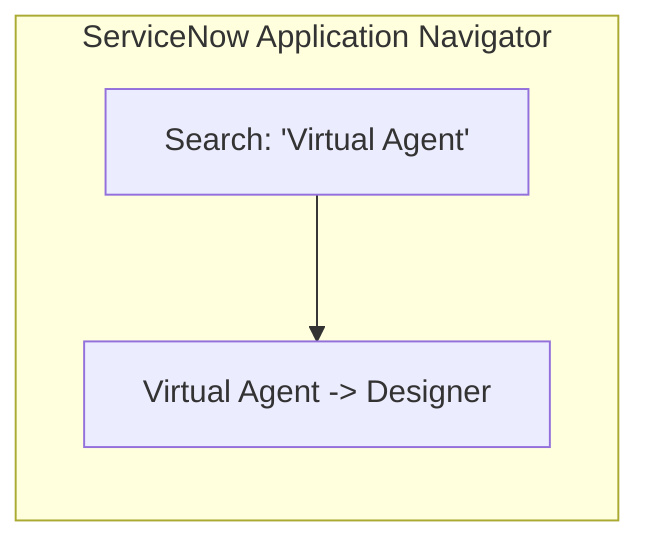
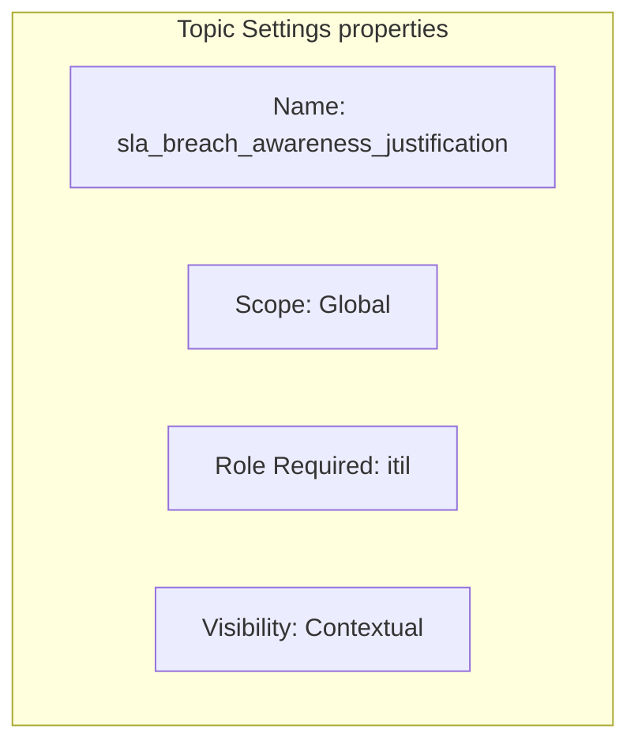
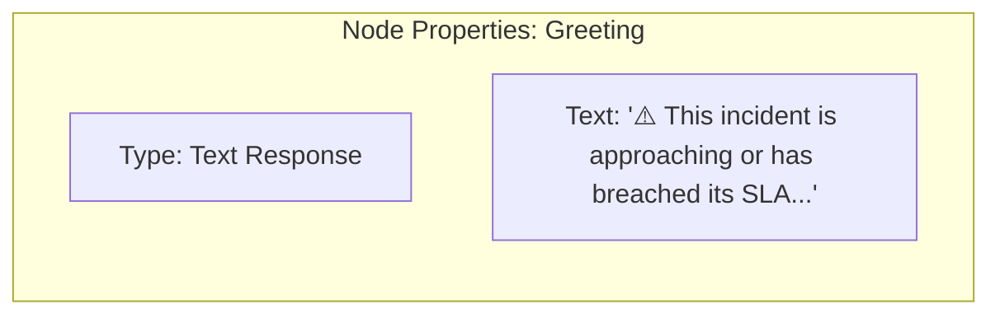
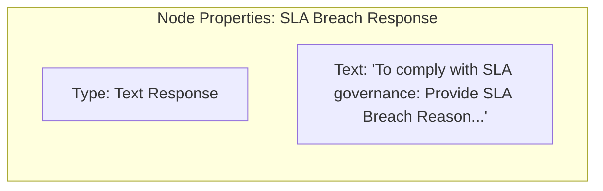
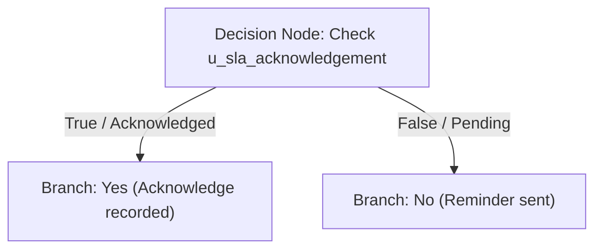
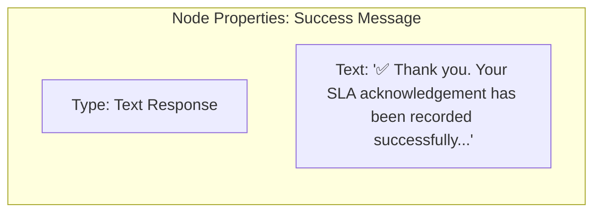
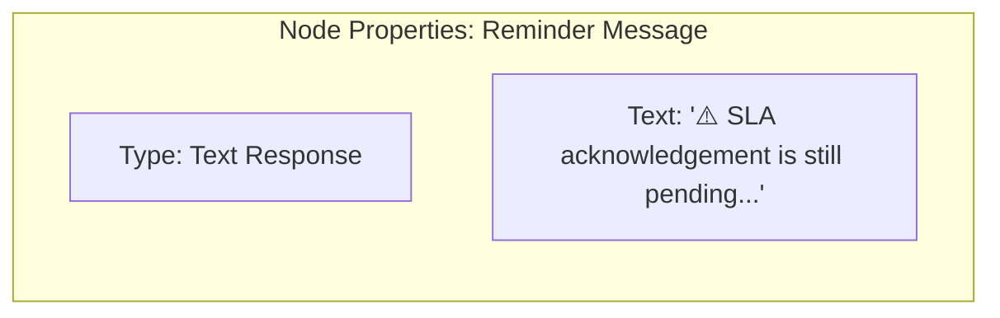
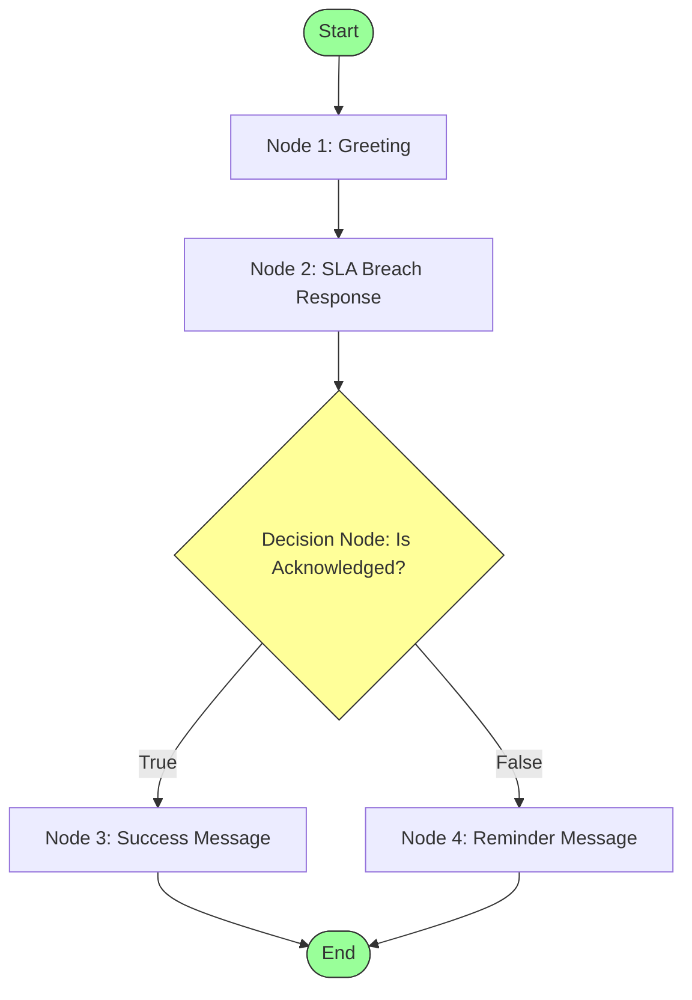

# Task 13: Configure Virtual Agent

## Project Title

**Virtual Agent–Driven SLA Breach Awareness & Justification System**

---

# Introduction

The ServiceNow Virtual Agent provides an interactive conversational interface that assists users in completing tasks without navigating multiple application screens. In this project, a Virtual Agent topic is created to notify users about SLA risks and guide them through acknowledging the SLA breach and providing the required justification.

The Virtual Agent helps improve SLA compliance by ensuring users complete mandatory SLA-related fields before saving the Incident.

---

# Objective

Create and configure a Virtual Agent topic that guides users through the SLA breach awareness and justification process.

---

# Navigation

**Virtual Agent → Designer → Create New**

---

# Topic Configuration

| Property | Value |
|----------|-------|
| Application Scope | Global |
| Type | Topic (Internal) |
| Name | sla_breach_awareness_justification |
| Display Name | SLA Breach Awareness & Justification |
| Visibility | Contextual (Record-based) |
| System Role | itil |
| Status | Active |

---

# Implementation Steps

## Step 1 – Open Virtual Agent Designer

1. Log in to ServiceNow.
2. Search for **Virtual Agent Designer**.
3. Navigate to:

**Virtual Agent → Designer**

4. Click **Create**.

---

## Step 2 – Create Topic

Enter the following information:

| Field | Value |
|------|------|
| Type | Topic (Internal) |
| Name | sla_breach_awareness_justification |
| Display Name | SLA Breach Awareness & Justification |
| Application Scope | Global |
| Visibility | Contextual |
| System Role | itil |

Click **Save**.

---

# Conversation Flow

## Greeting Response

### Node Type

Text Response

### Node Name

Greeting

### Message

```
⚠️ This incident is approaching or has breached its SLA.

Let's capture the reason and justification.
```

---

## Bot Response

### Node Type

Text Response

### Node Name

SLA Breach Response

### Message

```
To comply with SLA governance:

• Open the Incident form

• Provide SLA Breach Reason

• Add SLA Breach Justification

• Acknowledge SLA Risk

These fields are mandatory before saving the Incident.
```

---

## Decision Node

### Node Type

Decision

### Purpose

Verify whether the Incident has already been acknowledged.

---

### If TRUE

#### Text Response

```
✅ Thank you.

Your SLA acknowledgement has been recorded successfully.

The Incident now contains the required SLA justification information.
```

---

### If FALSE

#### Text Response

```
⚠️ SLA acknowledgement is still pending.

Please complete the following before saving:

• SLA Breach Reason

• SLA Breach Justification

• SLA Acknowledgement

These fields are mandatory.
```

---

# Conversation Flow Diagram

```
Start
   │
   ▼
Greeting
   │
   ▼
SLA Breach Response
   │
   ▼
Decision
 ┌─────────────┐
 │             │
Yes           No
 │             │
 ▼             ▼
Success     Reminder
Message     Message
```

---

# Working Process

1. User opens Virtual Agent.
2. Topic **SLA Breach Awareness & Justification** is selected.
3. Greeting message is displayed.
4. Bot explains the required SLA actions.
5. Decision node verifies acknowledgement.
6. If acknowledged, a success message is shown.
7. Otherwise, the user is reminded to complete all mandatory fields.

---

# Expected Result

- Virtual Agent topic created successfully.
- Topic available only for users with **itil** role.
- Greeting message displayed.
- SLA guidance provided.
- Decision node validates acknowledgement.
- Appropriate response displayed.
- Supports SLA governance workflow.

---

# Visual Blueprints & Flowcharts

### Figure 1 – Virtual Agent Designer Navigation

**Description:** Navigate to Virtual Agent Designer in the ServiceNow Application Navigator.



---

### Figure 2 – Topic Configuration

**Description:** Configure General Settings for the topic.



---

### Figure 3 – Greeting Node Properties

**Description:** Text Response greeting configuration.



---

### Figure 4 – SLA Breach Response Node Properties

**Description:** Bot response displaying the required fields list.



---

### Figure 5 – Decision Node Logic

**Description:** Branching logic verifying SLA Acknowledgement field.



---

### Figure 6 – True Path Response Properties

**Description:** Text response showing successful capture message.



---

### Figure 7 – False Path Response Properties

**Description:** Text response showing mandatory fields reminder.



---

### Figure 8 – Complete Conversation Flow Canvas

**Description:** Overview of the complete visual builder canvas structure.



---

> [!NOTE]
> *Due to image generation API rate limits, Figures 1 through 8 are rendered as exact visual logic blueprints representing the ServiceNow Virtual Agent Designer editor.*

---

# Benefits

- Interactive user guidance.
- Improved SLA compliance.
- Consistent justification capture.
- Reduced manual communication.
- Better user experience.
- Supports ServiceNow automation.
- No scripting required.

---

# Outcome

The Virtual Agent topic **SLA Breach Awareness & Justification** was successfully configured. It provides users with guided instructions for acknowledging SLA risks and submitting the required breach information, improving operational efficiency and SLA governance.

---

# Conclusion

The configured Virtual Agent enables proactive communication between the system and IT support staff. By guiding users through mandatory SLA actions, it strengthens accountability, improves incident management, and enhances the overall user experience using native ServiceNow Administration capabilities.
