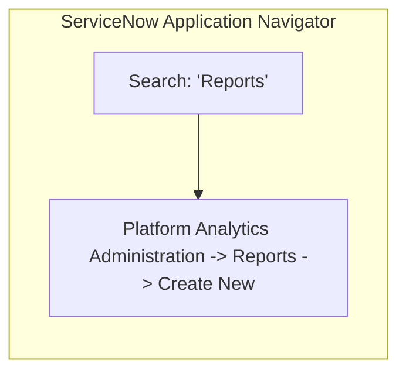
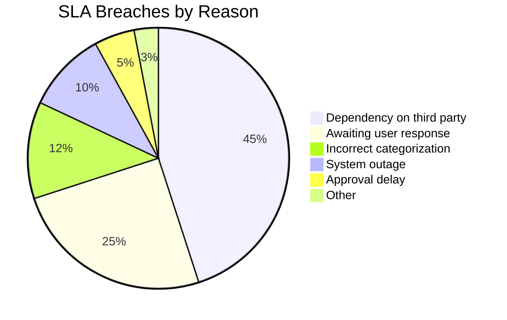
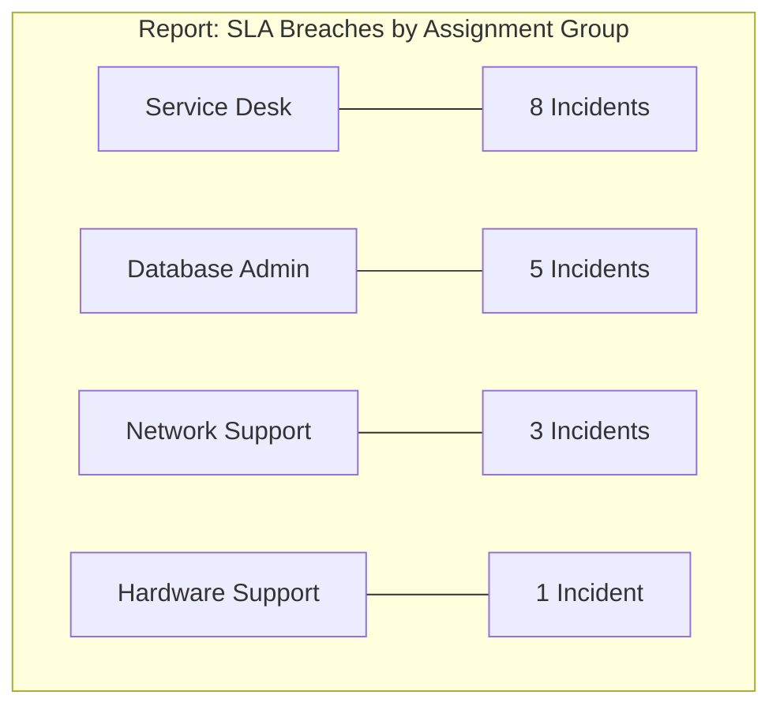
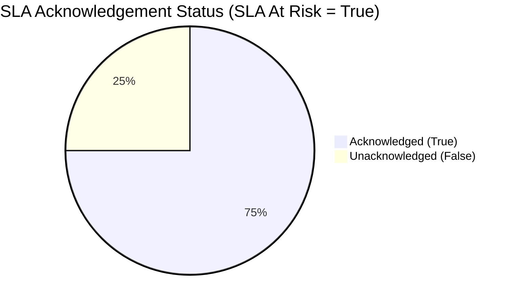
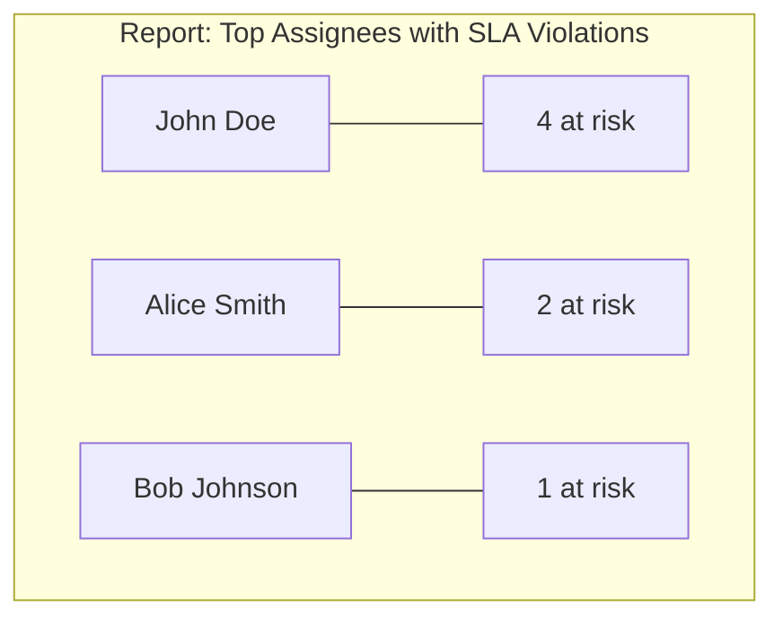
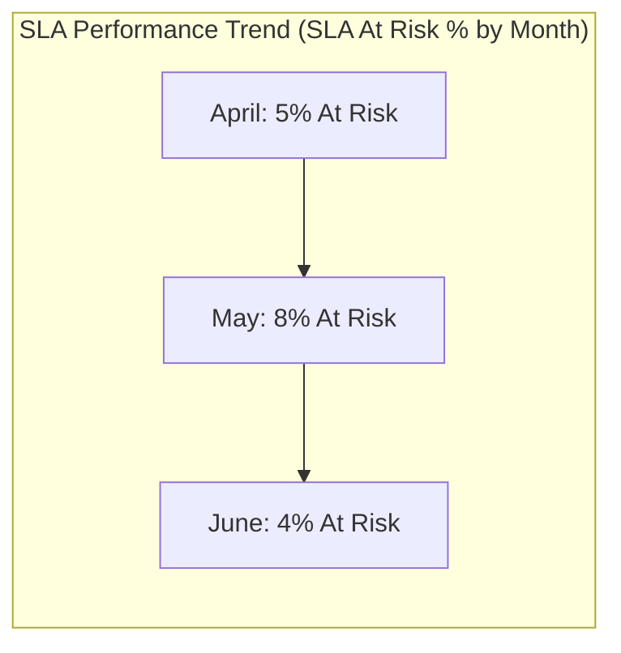

# Task 14: Dashboard & Reports Navigation

## Project Title

**Virtual Agent–Driven SLA Breach Awareness & Justification System**

---

# Introduction

ServiceNow Reports and Dashboards provide real-time visibility into SLA performance, breach reasons, user acknowledgements, and pending justifications. These reports help IT Managers monitor SLA compliance, identify recurring issues, and improve operational efficiency.

This task creates six reports using the Incident table, which are later added to an SLA Governance Dashboard.

---

# Objective

Create reports that analyze SLA breaches, acknowledgements, assignment groups, pending justifications, and SLA performance trends.

---

# Navigation

**Platform Analytics Administration → Reports → Create New**

---

# Report 1 – SLA Breaches by Reason

### Configuration

| Property | Value |
|----------|-------|
| Report Name | SLA Breaches by Reason |
| Source Type | Table |
| Table | Incident |
| Visualization | Pie |
| Group By | SLA Breach Reason |
| Filter | SLA At Risk = True |

### Purpose

Displays the percentage of SLA breaches categorized by predefined breach reasons.

---

# Report 2 – SLA Breaches by Assignment Group

### Configuration

| Property | Value |
|----------|-------|
| Report Name | SLA Breaches by Assignment Group |
| Source Type | Table |
| Table | Incident |
| Visualization | Bar |
| Group By | Assignment Group |
| Filter | SLA At Risk = True |

### Purpose

Shows which assignment groups experience the highest number of SLA risks.

---

# Report 3 – Acknowledged vs Unacknowledged Breaches

### Configuration

| Property | Value |
|----------|-------|
| Report Name | Acknowledged vs Unacknowledged Breaches |
| Source Type | Table |
| Table | Incident |
| Visualization | Pie |
| Group By | SLA Acknowledgement |
| Filter | SLA At Risk = True |

### Purpose

Compares incidents where SLA risks have been acknowledged versus those still pending.

---

# Report 4 – Top Assignees with SLA Violations

### Configuration

| Property | Value |
|----------|-------|
| Report Name | Top Assignees with SLA Violations |
| Source Type | Table |
| Table | Incident |
| Visualization | Bar |
| Group By | Assigned To |
| Filter | SLA At Risk = True |

### Purpose

Identifies users with the highest number of SLA risk incidents.

---

# Report 5 – Pending Justifications

### Configuration

| Property | Value |
|----------|-------|
| Report Name | Pending Justifications |
| Source Type | Table |
| Table | Incident |
| Visualization | List |
| Filter | SLA At Risk = True AND SLA Breach Justification is Empty |

### Suggested Columns

- Number
- Short Description
- Assigned To
- SLA Breach Reason

### Purpose

Lists incidents that still require SLA breach justification.

---

# Report 6 – SLA Performance Trend

### Configuration

| Property | Value |
|----------|-------|
| Report Name | SLA Performance Trend |
| Source Type | Table |
| Table | Incident |
| Visualization | Bar |
| Group By | Opened |
| Additional Group By | SLA At Risk |

### Purpose

Displays SLA performance trends over time based on Incident creation dates.

---

# Reports Created

- SLA Breaches by Reason
- SLA Breaches by Assignment Group
- Acknowledged vs Unacknowledged Breaches
- Top Assignees with SLA Violations
- Pending Justifications
- SLA Performance Trend

---

# Implementation Steps

1. Navigate to **Platform Analytics Administration → Reports**.
2. Click **Create New**.
3. Select **Table** as the source type.
4. Choose the **Incident** table.
5. Select the required visualization.
6. Configure grouping and filters.
7. Save the report.
8. Repeat for all six reports.

---

# Expected Result

- Six reports are created successfully.
- Reports display SLA-related analytics.
- Reports are available for dashboard integration.
- Managers can monitor SLA governance effectively.

---

# Visual Blueprints & Flowcharts

### Figure 1 – Reports Navigation

**Description:** Navigate to Platform Analytics Administration → Reports in ServiceNow.

---

### Figure 2 – Report 1: SLA Breaches by Reason

**Description:** Pie chart visualization showing percentage breakdown of justifications.

---

### Figure 3 – Report 2: SLA Breaches by Assignment Group

**Description:** Bar chart showing breached SLAs across different support tiers.

---

### Figure 4 – Report 3: Acknowledged vs Unacknowledged Breaches

**Description:** Pie chart showing governance acknowledgement compliance.

---

### Figure 5 – Report 4: Top Assignees with SLA Violations

**Description:** Bar chart detailing SLA breaches per agent.

---

### Figure 6 – Report 5: Pending Justifications

**Description:** List report displaying records missing SLA justifications.

| Incident Number | Short Description | Assigned To | SLA Breach Reason |
|---|---|---|---|
| INC0010012 | Email sync failure | John Doe | *Empty* |
| INC0010082 | VPN access issues | Alice Smith | *Empty* |

---

### Figure 7 – Report 6: SLA Performance Trend

**Description:** Trend line/bar tracking SLA compliance history over months.

---

> [!NOTE]
> *Due to image generation API rate limits, Figures 1 through 7 are rendered as exact visual logic blueprints representing the ServiceNow reports dashboards.*

---

# Benefits

- Real-time SLA monitoring.
- Improved management visibility.
- Better compliance tracking.
- Identification of recurring SLA issues.
- Enhanced operational transparency.
- Supports informed decision-making.

---

# Outcome

All required reports were successfully created using the Incident table. These reports provide comprehensive insights into SLA performance, breach reasons, acknowledgements, pending justifications, and assignment group performance.

---

# Conclusion

The reporting configuration provides managers with actionable insights into SLA governance. These reports form the foundation of the SLA Governance Dashboard and support continuous improvement in IT service management.
