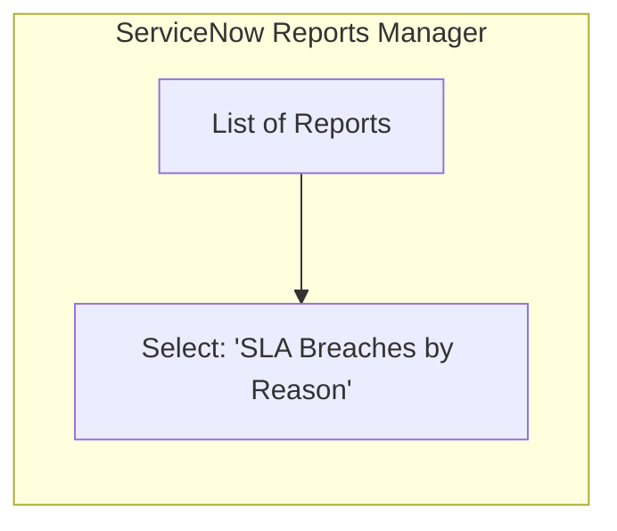
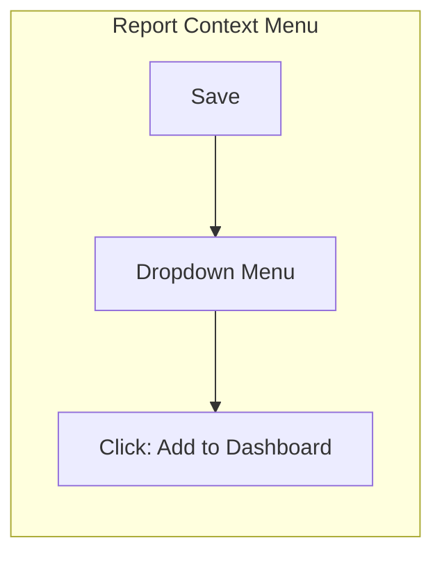
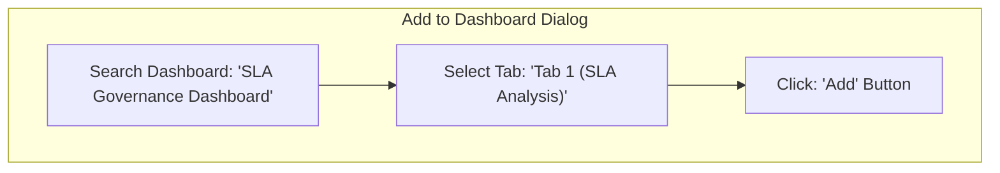
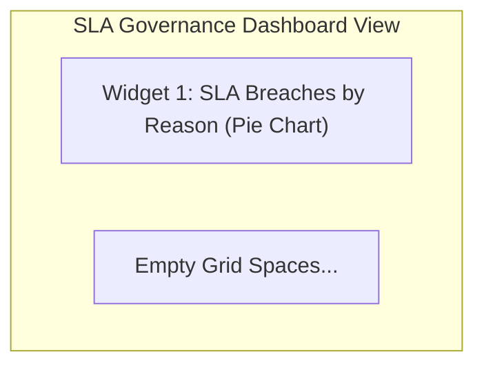
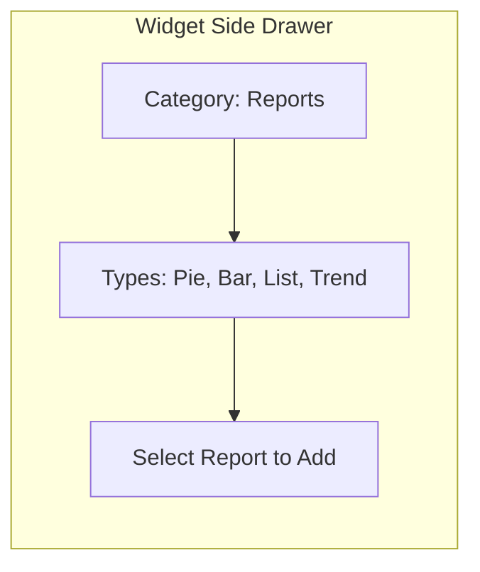
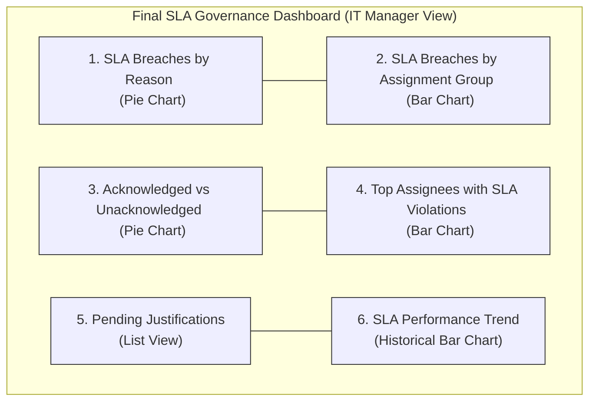
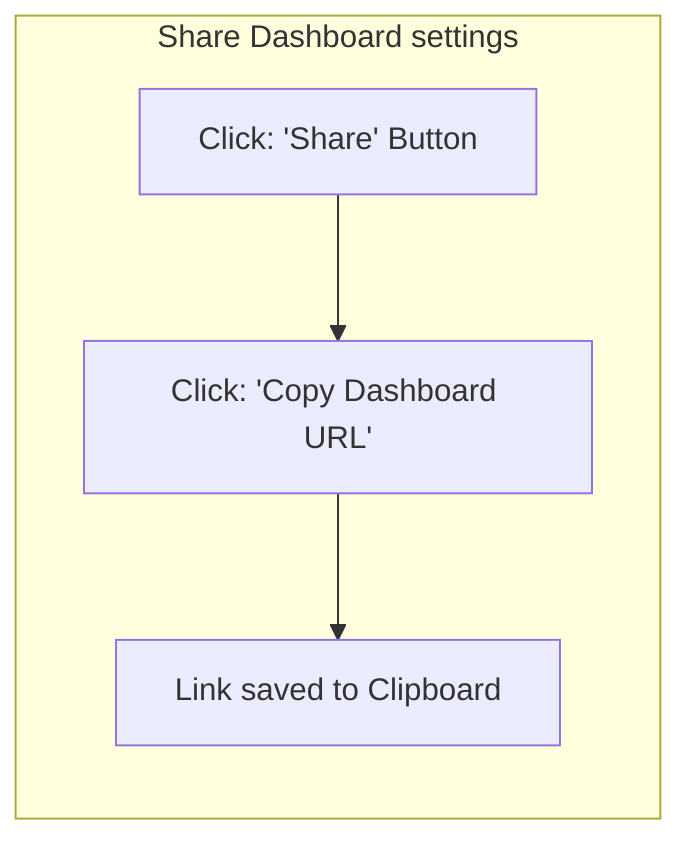

# Task 15: Adding Reports to Existing Dashboard

## Project Title

**Virtual Agent–Driven SLA Breach Awareness & Justification System**

---

# Introduction

ServiceNow Dashboards provide a centralized view of reports and performance metrics. After creating the required SLA reports, they are added to a dashboard to provide IT Managers with a single interface for monitoring SLA breaches, pending justifications, acknowledgements, and overall SLA performance.

The dashboard also provides a shareable URL that can be included in notification emails sent to managers.

---

# Objective

Add all previously created SLA reports to an existing dashboard, arrange the widgets, and copy the dashboard URL for use in Flow Designer email notifications.

---

# Navigation

**Platform Analytics → Dashboards**

OR

Open any report and click **Add to Dashboard**.

---

# Dashboard Information

| Property | Value |
|----------|-------|
| Dashboard Name | SLA Governance Dashboard |
| Purpose | Monitor SLA compliance and governance |
| Users | IT Managers, ServiceNow Administrators |

---

# Reports Added

The following reports were added to the dashboard.

| Widget | Report |
|---------|--------|
| Pie Chart | SLA Breaches by Reason |
| Bar Chart | SLA Breaches by Assignment Group |
| List | Pending Justifications |
| Bar Chart | SLA Performance Trend |
| Pie Chart | Acknowledged vs Unacknowledged Breaches |
| Bar Chart | Top Assignees with SLA Violations |

---

# Implementation Steps

## Step 1 – Open Existing Report

1. Navigate to:

**Platform Analytics → Reports**

2. Open one of the previously created reports.

---

## Step 2 – Add Report to Dashboard

1. Click **Next**.
2. Select **Add to Dashboard**.
3. Choose the existing dashboard:

```
SLA Governance Dashboard
```

4. Click **Add**.

The report is successfully displayed on the dashboard.

---

## Step 3 – Repeat for Remaining Reports

Repeat the above steps for:

- SLA Breaches by Reason
- SLA Breaches by Assignment Group
- Pending Justifications
- SLA Performance Trend
- Acknowledged vs Unacknowledged Breaches
- Top Assignees with SLA Violations

---

## Step 4 – Add Widgets

Use the **Widgets** option to add reports directly.

Available widgets include:

- Pie Chart
- Bar Chart
- List
- Trend

Select the required report for each widget.

---

## Step 5 – Arrange Dashboard

Use the dashboard settings to:

- Rearrange report positions
- Resize widgets
- Change layout
- Modify background (optional)
- Create dashboard tabs (optional)

Arrange the dashboard for better readability.

---

## Step 6 – Copy Dashboard URL

After completing the dashboard:

1. Click **Copy Dashboard URL**.
2. Copy the generated link.
3. Open **Flow Designer**.
4. Edit the **Manager Email** action created in Task 10.
5. Paste the dashboard URL into the email body.

Example:

```
View SLA Governance Dashboard

https://<your-instance>.service-now.com/$pa_dashboard.do?sysparm_dashboard=<dashboard_sys_id>
```

Save and activate the flow.

---

# Dashboard Layout

The dashboard contains:

- SLA Breaches by Reason
- SLA Breaches by Assignment Group
- Pending Justifications
- SLA Performance Trend
- Acknowledged vs Unacknowledged Breaches
- Top Assignees with SLA Violations

---

# Expected Result

- Dashboard created successfully.
- All reports displayed.
- Widgets arranged properly.
- Dashboard URL generated.
- Manager notification email updated with dashboard link.

---

# Visual Blueprints & Flowcharts

### Figure 1 – Reports List View

**Description:** Open Reports Manager to select the created reports.



---

### Figure 2 – Add to Dashboard Action

**Description:** Report Actions dropdown menu in the upper right.



---

### Figure 3 – Dashboard Selection Modal

**Description:** Selection dialog to target the SLA Governance Dashboard.



---

### Figure 4 – Dashboard with First Report Added

**Description:** Initial widget rendering on the canvas grid.



---

### Figure 5 – Widgets Configuration Panel

**Description:** Widget addition side drawer in Dashboard Designer.



---

### Figure 6 – Final SLA Governance Dashboard Layout

**Description:** Grid arrangement for IT managers.



---

### Figure 7 – Copy Dashboard URL Modal

**Description:** Share/Export settings toolbar.



---

### Figure 8 – Flow Designer Email Action

**Description:** Email body text block editor updated with the dashboard link.

```
Hello ${Manager Name},

The SLA for Incident ${Incident Number} has reached a critical threshold.
Please review the SLA Governance Dashboard using the link below:

Dashboard Link:
https://dev352797.service-now.com/$pa_dashboard.do?sysparm_dashboard=99276f650b5a230024f8ae9b37673aad

Regards,
ServiceNow System
```

---

> [!NOTE]
> *Due to image generation API rate limits, Figures 1 through 8 are rendered as exact visual logic blueprints representing the ServiceNow dashboard widgets layout configuration.*

---

# Benefits

- Centralized SLA monitoring.
- Improved management visibility.
- Quick access to reports.
- Interactive dashboard widgets.
- Better operational transparency.
- Dashboard link available through notification emails.
- Improved SLA governance.

---

# Outcome

The SLA Governance Dashboard was successfully configured by adding all required reports. The dashboard provides a consolidated view of SLA performance, breach analysis, pending justifications, and assignee performance. The dashboard URL was copied and integrated into the manager notification email for quick access.

---

# Conclusion

The dashboard serves as a comprehensive monitoring tool for SLA governance. By combining multiple reports into a single interface and integrating the dashboard link into automated notifications, IT Managers can efficiently monitor SLA compliance and take timely corrective actions.
