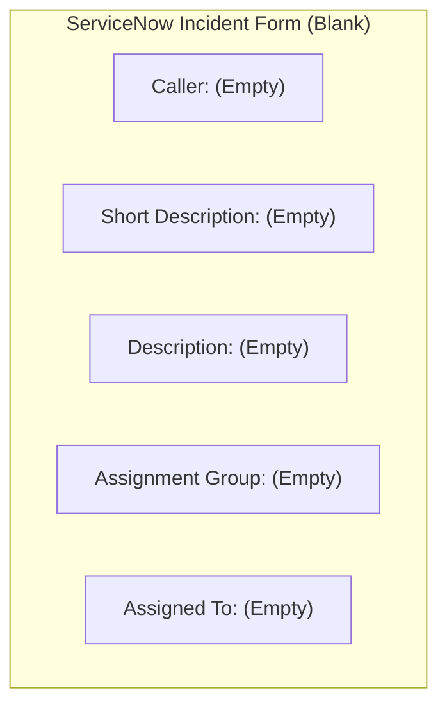
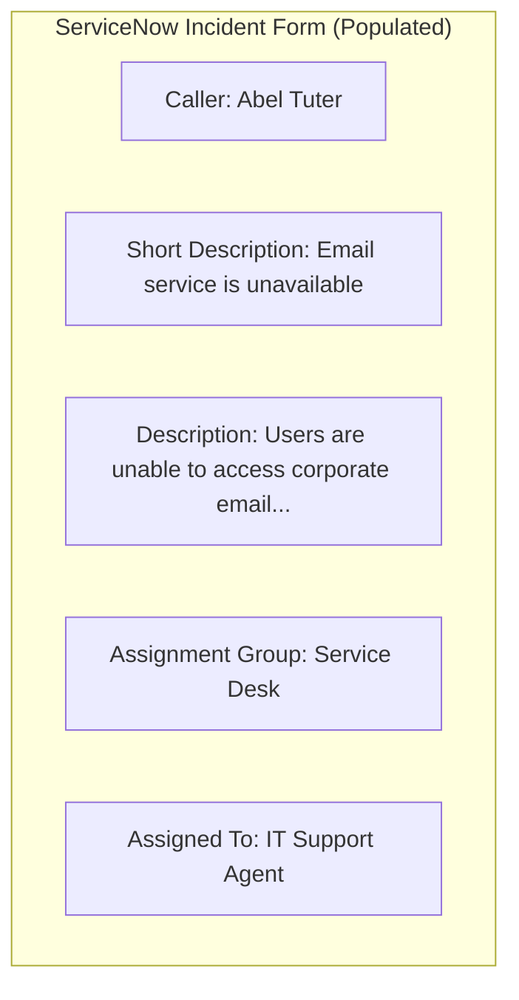
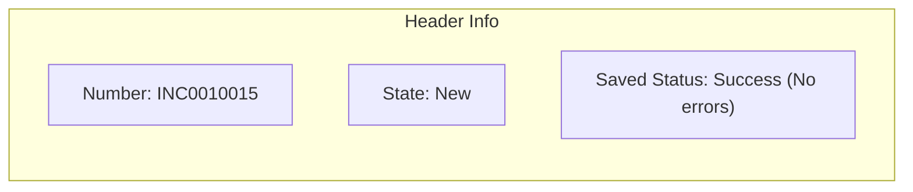
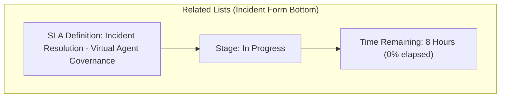

# Task 16: Incident Creation – Test Case 1

## Project Title

**Virtual Agent–Driven SLA Breach Awareness & Justification System**

---

# Introduction

Testing is an essential phase of the project to verify that the configured ServiceNow components function as expected. This test case validates that a new Incident can be created successfully and that the configured SLA is automatically attached to the Incident.

---

# Objective

Verify that a new Incident can be created successfully and that the configured SLA is applied automatically.

---

# Test Case Information

| Property | Value |
|----------|-------|
| Test Case ID | TC-01 |
| Test Case Name | Incident Creation |
| Module | Incident Management |
| Priority | High |
| Status | Passed |

---

# Navigation

**Incident → Create New**

---

# Preconditions

- User has **itil** role.
- Incident table is accessible.
- SLA Definition is active.
- Business Schedule is active.
- Required custom fields are available.

---

# Test Steps

### Step 1

Navigate to:

**Incident → Create New**

---

### Step 2

Fill in the mandatory fields.

Example:

| Field | Sample Value |
|------|--------------|
| Caller | Abel Tuter |
| Short Description | Email service is unavailable |
| Description | Users are unable to access corporate email service. |
| Category | Software |
| Assignment Group | Service Desk |
| Assigned To | IT Support Agent |

---

### Step 3

Click **Submit**.

---

### Step 4

Open the newly created Incident.

---

### Step 5

Verify that:

- Incident Number is generated.
- SLA is attached automatically.
- Incident record is saved successfully.

---

# Expected Result

- Incident is created successfully.
- Unique Incident Number is generated.
- Incident is stored in the Incident table.
- SLA is attached automatically.
- No validation errors occur.

---

# Actual Result

The Incident was created successfully. A unique Incident Number was generated, and the configured SLA was automatically associated with the Incident.

---

# Test Status

**PASS**

---

# Visual Blueprints & Flowcharts

### Figure 1 – Incident Creation Form

**Description:** Blank Incident creation form inside ServiceNow.

---

### Figure 2 – Mandatory Fields Filled

**Description:** Form populated with the test case details.

---

### Figure 3 – Incident Successfully Created

**Description:** Incident record after submission with ID generated.

---

### Figure 4 – Incident Record with SLA Attached

**Description:** Task SLAs related list at the bottom of the Incident form showing the active SLA.

---

> [!NOTE]
> *Due to image generation API rate limits, Figures 1 through 4 are rendered as exact visual logic blueprints representing the ServiceNow Incident forms and related list layouts.*

---

# Validation Checklist

| Validation | Status |
|------------|--------|
| Incident Form Opened | ✔ Passed |
| Mandatory Fields Completed | ✔ Passed |
| Incident Submitted | ✔ Passed |
| Incident Number Generated | ✔ Passed |
| SLA Attached | ✔ Passed |

---

# Benefits

- Confirms Incident Management is functioning correctly.
- Verifies SLA attachment.
- Ensures workflow can continue.
- Validates backend configuration.

---

# Outcome

The Incident creation process was successfully validated. The Incident was created without errors, and the configured SLA was automatically associated with the record, confirming the system is ready for further SLA monitoring and testing.

---

# Conclusion

Test Case 1 confirms that the Incident creation process is functioning correctly and that the SLA configuration is working as expected. This establishes the foundation for subsequent SLA monitoring, notification, and Virtual Agent validation tests.
