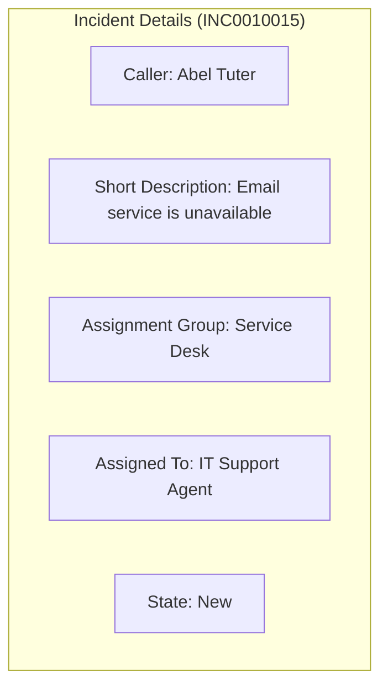
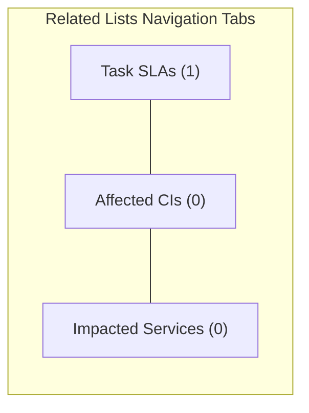
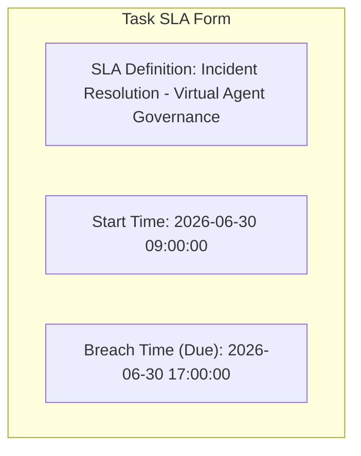
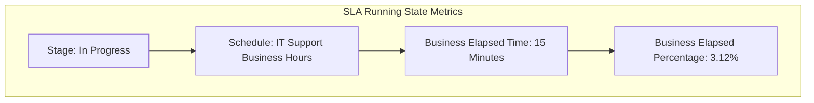

# Task 17: SLA Attachment & Running – Test Case 2

## Project Title

**Virtual Agent–Driven SLA Breach Awareness & Justification System**

---

# Introduction

After successfully creating an Incident, the next step is to verify that the configured SLA is automatically attached to the Incident and begins tracking its progress. This ensures that the SLA Definition and Business Schedule are functioning correctly.

---

# Objective

Verify that the configured SLA is automatically attached to the Incident and begins tracking elapsed business time.

---

# Test Case Information

| Property | Value |
|----------|-------|
| Test Case ID | TC-02 |
| Test Case Name | SLA Attachment & Running |
| Module | Service Level Management |
| Priority | High |
| Status | Passed |

---

# Navigation

**Incident → Open Existing Incident → Related Lists → Task SLA**

---

# Preconditions

- Incident has been created successfully.
- SLA Definition is active.
- Business Schedule is configured.
- SLA Conditions are configured correctly.

---

# Test Steps

### Step 1

Open the Incident created during **Test Case 1**.

---

### Step 2

Scroll to the **Related Lists** section.

---

### Step 3

Open the **Task SLA** related list.

---

### Step 4

Verify that an SLA record is available.

---

### Step 5

Open the SLA record and verify:

- SLA Definition
- Start Time
- Due Date
- Stage
- Business Elapsed Percentage

---

### Step 6

Wait a few minutes and refresh the record.

Verify that the **Business Elapsed Percentage** increases according to the configured business schedule.

---

# Expected Result

- SLA record is automatically attached.
- SLA Definition is displayed correctly.
- SLA Due Date is populated.
- SLA Stage shows **In Progress**.
- Business Elapsed Percentage increases over time.
- SLA is calculated using the configured business schedule.

---

# Actual Result

The configured SLA was automatically attached to the Incident. The SLA Due Date was calculated successfully, the stage displayed **In Progress**, and the Business Elapsed Percentage increased as expected.

---

# Test Status

**PASS**

---

# Visual Blueprints & Flowcharts

### Figure 1 – Incident Record Details

**Description:** ServiceNow Incident form details for the test incident record.

---

### Figure 2 – Task SLA Related List

**Description:** Related Lists tabs rendered at the bottom of the Incident form.

---

### Figure 3 – SLA Record Details

**Description:** Expanded fields inside the associated Task SLA record.

---

### Figure 4 – SLA Running (Stage: In Progress)

**Description:** Live execution metrics showing business percentage increase over time.

---

> [!NOTE]
> *Due to image generation API rate limits, Figures 1 through 4 are rendered as exact visual logic blueprints representing the ServiceNow Incident SLAs database states.*

---

# Validation Checklist

| Validation | Status |
|------------|--------|
| Incident Opened | ✔ Passed |
| Task SLA Visible | ✔ Passed |
| SLA Definition Attached | ✔ Passed |
| SLA Due Date Generated | ✔ Passed |
| SLA Stage = In Progress | ✔ Passed |
| Business Elapsed Percentage Increasing | ✔ Passed |

---

# Benefits

- Confirms automatic SLA attachment.
- Verifies SLA timer functionality.
- Ensures business schedule is applied correctly.
- Validates SLA tracking before notification testing.

---

# Outcome

The SLA was successfully attached to the Incident, and the SLA timer started automatically. The due date, stage, and elapsed percentage were updated correctly, confirming that the SLA configuration is functioning as intended.

---

# Conclusion

Test Case 2 successfully validates the SLA attachment and execution process. The system automatically associates the SLA with the Incident and continuously tracks business elapsed time, enabling proactive SLA monitoring and governance.
