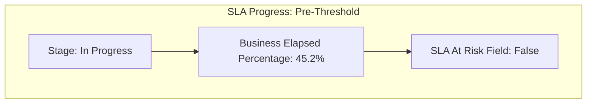
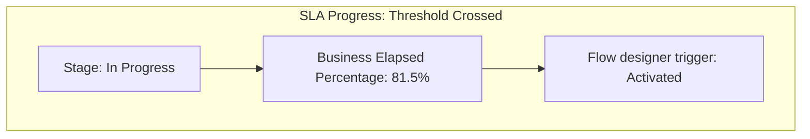
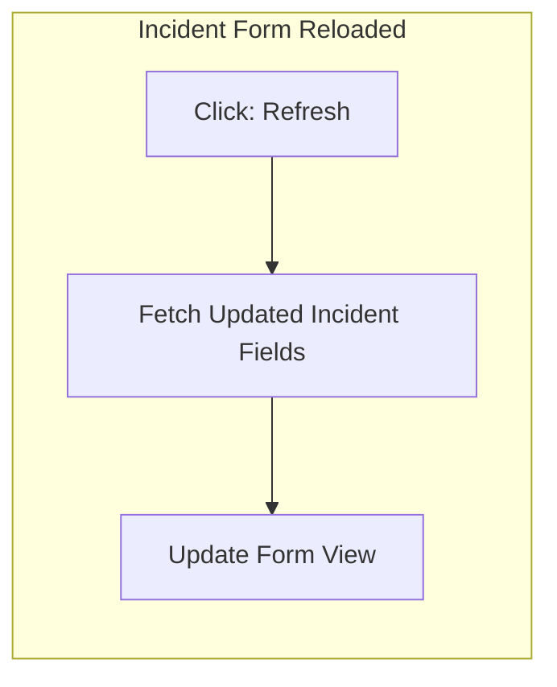
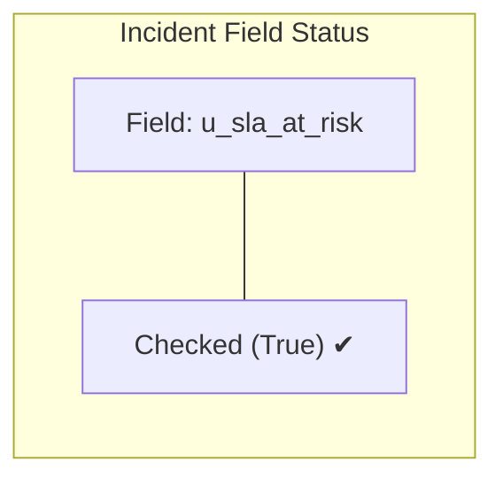
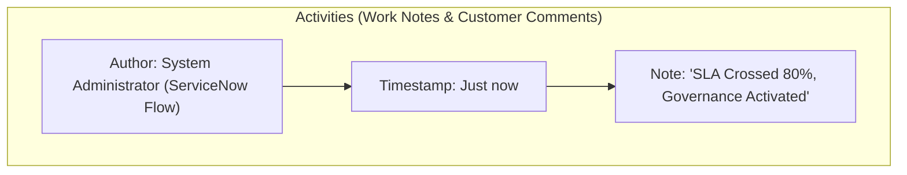

# Task 18: SLA At Risk Trigger – Test Case 3

## Project Title

**Virtual Agent–Driven SLA Breach Awareness & Justification System**

---

# Introduction

This test case verifies that the **SLA At Risk** field is automatically updated when the **Business Elapsed Percentage** of an Incident SLA reaches or exceeds **80%**. The Flow Designer automation created in previous tasks should detect this threshold and update the Incident record accordingly.

---

# Objective

Verify that the **SLA At Risk** flag is automatically set to **True** when the configured SLA reaches or exceeds 80% of its business elapsed time.

---

# Test Case Information

| Property | Value |
|----------|-------|
| Test Case ID | TC-03 |
| Test Case Name | SLA At Risk Trigger |
| Module | Service Level Management |
| Priority | High |
| Status | Passed |

---

# Navigation

**Incident → Open Existing Incident**

---

# Preconditions

- Incident created successfully.
- SLA attached and running.
- Flow Designer notification flow is active.
- Business Schedule is active.
- SLA Definition is active.

---

# Test Steps

### Step 1

Open the existing Incident with an active SLA.

---

### Step 2

Wait until the **Business Elapsed Percentage** reaches **80% or higher**.

---

### Step 3

Refresh the Incident record.

---

### Step 4

Verify the following:

- SLA At Risk field is automatically checked.
- Work Notes are updated.
- Flow execution has occurred.

---

# Expected Result

- Business Elapsed Percentage reaches **80%**.
- **SLA At Risk** becomes **True** automatically.
- Work Notes display:

```
SLA Crossed 80%, Governance Activated
```

- Incident is marked as approaching SLA breach.

---

# Actual Result

The Business Elapsed Percentage exceeded 80%, and the configured Flow Designer automation automatically updated the Incident. The **SLA At Risk** field was set to **True**, and the work notes were updated successfully.

---

# Test Status

**PASS**

---

# Visual Blueprints & Flowcharts

### Figure 1 – Incident Before 80% SLA

**Description:** Task SLA metrics showing progress below the threshold.



---

### Figure 2 – SLA Business Elapsed Percentage ≥ 80%

**Description:** SLA record metrics after crossing the critical threshold.



---

### Figure 3 – Incident After Refresh

**Description:** Reloaded ServiceNow Incident page with dynamic state changes applied.



---

### Figure 4 – SLA At Risk = True

**Description:** Checkbox field status on the Incident details layout.



---

### Figure 5 – Work Notes Updated

**Description:** Activities stream showing the system-generated entry.



---

> [!NOTE]
> *Due to image generation API rate limits, Figures 1 through 5 are rendered as exact visual logic blueprints representing the ServiceNow Incident forms and related list states.*

---

# Validation Checklist

| Validation | Status |
|------------|--------|
| Incident Opened | ✔ Passed |
| SLA Running | ✔ Passed |
| Business Elapsed ≥ 80% | ✔ Passed |
| SLA At Risk = True | ✔ Passed |
| Work Notes Updated | ✔ Passed |
| Flow Executed Successfully | ✔ Passed |

---

# Benefits

- Confirms Flow Designer trigger works correctly.
- Enables proactive SLA monitoring.
- Prevents SLA breaches through early notification.
- Validates automatic Incident updates.
- Supports Virtual Agent workflow.

---

# Outcome

The SLA At Risk automation worked successfully. When the SLA crossed the 80% threshold, the Incident was updated automatically, the **SLA At Risk** flag was enabled, and the work notes reflected the SLA governance action.

---

# Conclusion

Test Case 3 successfully validates the automatic SLA At Risk trigger. The configured Flow Designer logic correctly identifies Incidents nearing SLA breach and updates the Incident record without manual intervention, ensuring proactive SLA governance.
