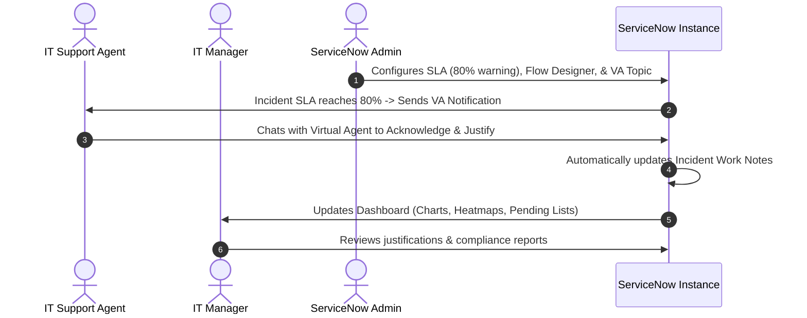

# Virtual Agent–Driven SLA Breach Awareness & Justification System

This project aims to improve SLA governance by integrating ServiceNow Virtual Agent capabilities with SLA monitoring and justification tracking. The solution proactively notifies assignees before an SLA breach, captures acknowledgements and justifications, and provides management with meaningful reports and dashboards—all by leveraging native ServiceNow Administration features without custom scripting.

---

## Stakeholder Role Mapping & Interactions

Based on the **Stakeholder Mapping**, the system supports three distinct roles. In the ServiceNow platform, these are mapped to specific groups, roles, and UI views:

### 1. IT Support Agent
* **Platform Mapping**: Standard ITIL User (`itil` role).
* **Key Experience**:
  * Receives Virtual Agent chat notifications when an assigned incident's SLA reaches 80%.
  * Interacts with the Virtual Agent to submit acknowledgements and justifications.
  * Sees the Incident's activity stream update with their justification.

### 2. IT Manager
* **Platform Mapping**: ITIL Manager (`itil_admin` or custom manager role).
* **Key Experience**:
  * Accesses the **SLA Governance Dashboard** to monitor team compliance.
  * Reviews justification trends (e.g., identifying if "Awaiting Customer" is the primary cause of delays).
  * Audits pending justifications.

### 3. ServiceNow Administrator
* **Platform Mapping**: System Administrator (`admin` role).
* **Key Experience**:
  * Configures **SLA Definitions** (`contract_sla`) and **Business Schedules** (e.g., 8-5 Weekdays).
  * Manages the **Flow Designer** that triggers the notification at 80% elapsed time.
  * Designs and maintains the **Virtual Agent Topic** in Virtual Agent Designer.
  * Configures **UI Policies** to make justification fields read-only for non-assignees.

---

## Delivery Options

Since we are working in a local development environment, we have two ways to proceed:

### Option 1: Detailed Configuration & Design Document (ServiceNow Blueprints)
We will generate a complete set of XML-compatible design specifications, Flow Designer configurations, Virtual Agent topic design maps, and Dashboard configuration guides.

### Option 2: Interactive Web Prototype (Highly Recommended)
We will build a premium, high-fidelity web application using **HTML, CSS (Vanilla), and JavaScript** featuring a **Role-Based Experience**:

* **Role Switcher**: A persistent top navigation bar allowing you to switch between:
  1. 👤 **IT Support Agent View**:
     * Incident List showing SLA progress bars (changing color at 80%).
     * Simulated Virtual Agent Chat Widget that pops up with a notification, prompts for justification, and updates the incident.
     * Incident Detail View showing the automated **Work Notes** update in the Activity stream.
  2. 📊 **IT Manager View**:
     * SLA Governance Dashboard with interactive charts (Breach Risk Heatmap, Justification Compliance, Justification Categories, Pending Justifications).
     * Filterable list of justification records.
  3. ⚙️ **ServiceNow Admin View**:
     * A "ServiceNow Studio" simulator showing the configuration under the hood:
       * **SLA Definition Settings** (e.g., Start/Stop/Pause conditions, Business Schedule).
       * **Flow Designer Blueprint** (visual flow showing the 80% trigger and VA action).
       * **Virtual Agent Topic Flowchart** (visualizing the conversational logic and security checks).

---

## User Review Required

> [!IMPORTANT]
> Please review the updated plan. We recommend **Option 2 (Interactive Web Prototype)** with the **Role Switcher** as it provides a comprehensive, interactive demonstration of how all three stakeholders interact with the system.

---

## Open Questions

1. **Business Schedules**: For SLA monitoring, should we assume a standard **8-5 Weekdays** schedule or a **24x7** schedule? *This affects how remaining time is calculated and displayed to the IT Support Agent.*
2. **Dashboard Filters**: Should the IT Manager be able to filter the dashboard by Assignment Group or Category?
