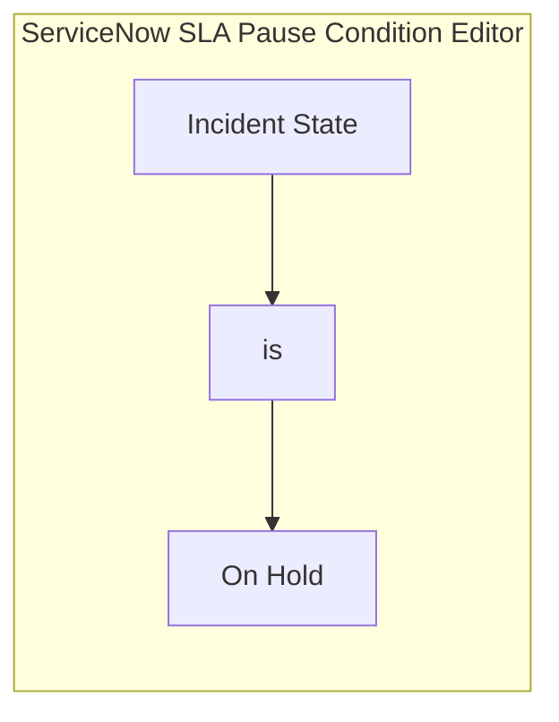
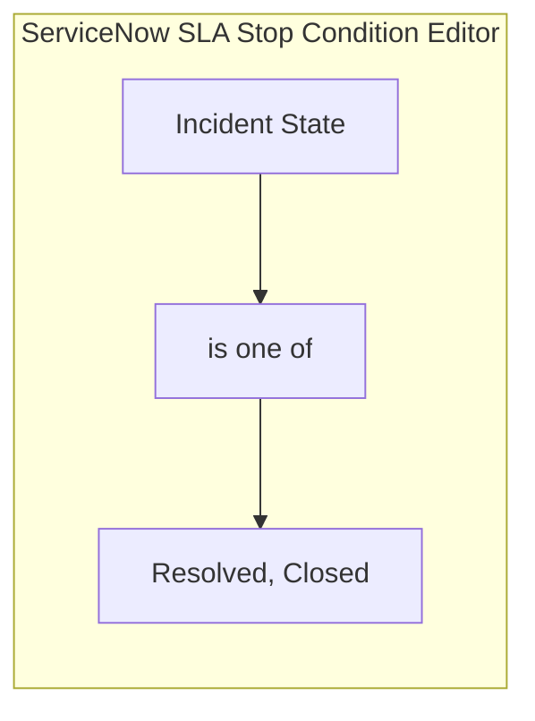
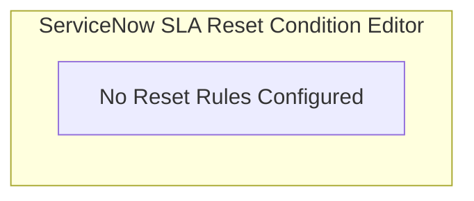

# Task 8: Configure SLA Start / Stop / Pause Conditions

## Project Title

**Virtual Agent–Driven SLA Breach Awareness & Justification System**

---

# Introduction

Service Level Agreements (SLAs) rely on conditions that determine when an SLA should begin, pause, stop, or reset. Properly configuring these conditions ensures accurate SLA tracking and reliable measurement of incident resolution performance.

For this project, the SLA is configured to monitor Incident Resolution while considering the incident lifecycle.

---

# Objective

Configure the SLA lifecycle conditions for Incident records to accurately calculate SLA performance during business hours.

---

# Navigation

**Service Level Management → SLA Definitions**

Open the previously created SLA:

**Incident Resolution - Virtual Agent Governance**

Navigate to the **Conditions** section.

---

# SLA Conditions Configuration

## Start Condition

| Field | Value |
|--------|-------|
| Active | True |
| Incident State | New, In Progress |

**Description**

The SLA starts automatically when an Incident is created and its state is **New** or **In Progress**.

---

## Pause Condition

| Field | Value |
|--------|-------|
| Incident State | On Hold |

**Description**

The SLA timer pauses whenever the Incident is placed **On Hold**.

---

## Stop Condition

| Field | Value |
|--------|-------|
| Incident State | Resolved, Closed |

**Description**

The SLA stops once the Incident reaches the **Resolved** or **Closed** state.

---

## Reset Condition

| Field | Value |
|--------|-------|
| None | Not Configured |

**Description**

No reset condition is configured. Once an SLA starts, it continues until it is stopped.

---

# Implementation Steps

## Step 1

Open **Service Level Management → SLA Definitions**.

---

## Step 2

Open the SLA:

**Incident Resolution - Virtual Agent Governance**

---

## Step 3

Configure the **Start Condition**.

- Active = True
- State = New OR In Progress

---

## Step 4

Configure the **Pause Condition**.

- State = On Hold

---

## Step 5

Configure the **Stop Condition**.

- State = Resolved OR Closed

---

## Step 6

Leave the **Reset Condition** empty.

Click **Update**.

---

# Screenshots & Visual Blueprints

## Figure 1 – Start Condition

**Description:** The ServiceNow Start Condition form showing the active state rules.

---

## Figure 2 – Pause Condition

**Description:** The ServiceNow Pause Condition form filter rules.

---

## Figure 3 – Stop Condition

**Description:** The ServiceNow Stop Condition form filter rules.

---

## Figure 4 – Reset Condition

**Description:** The ServiceNow Reset Condition section showing no defined rules.

---

> [!NOTE]
> *Due to image generation API rate limits, Figures 2, 3, and 4 are rendered as exact visual logic blueprints representing the ServiceNow filter condition fields.*

---

# Expected Result

- SLA starts automatically when an Incident is created.
- SLA pauses when the Incident is On Hold.
- SLA resumes when the Incident is active again.
- SLA stops after the Incident is resolved.
- No unnecessary SLA resets occur.

---

# Benefits

- Accurate SLA calculations.
- Business-hour-based tracking.
- Reduced false SLA breaches.
- Improved SLA governance.
- Better reporting accuracy.

---

# Outcome

The SLA lifecycle conditions were successfully configured to monitor Incident resolution efficiently. The configured conditions ensure that the SLA behaves correctly throughout the Incident lifecycle and supports proactive SLA awareness using the Virtual Agent.

---

# Conclusion

Proper configuration of SLA Start, Pause, Stop, and Reset conditions is essential for reliable SLA management. These settings improve the accuracy of SLA calculations and strengthen incident management within the ServiceNow platform.
