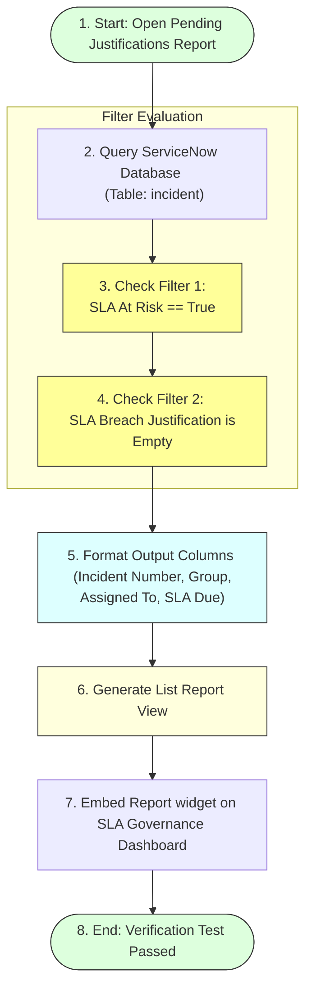

# Task 25: Reporting – Pending Justifications (Test Case 10)

## Project Title

**Virtual Agent–Driven SLA Breach Awareness & Justification System**

---

# Introduction

This test case verifies that the **Pending Justifications** report correctly identifies Incident records where the SLA is at risk but the **SLA Breach Justification** field has not been completed. The report helps administrators and managers quickly identify incidents requiring justification, ensuring SLA compliance and improving governance.

---

# Objective

Verify that the **Pending Justifications** report displays all incidents where **SLA At Risk = True** and the **SLA Breach Justification** field is empty.

---

# Report Query Filter Execution Flow

---

# Test Case Information

| Property | Value |
|----------|-------|
| **Test Case ID** | TC-10 |
| **Test Case Name** | Reporting – Pending Justifications |
| **Module** | Platform Analytics / Reports |
| **Priority** | Medium |
| **Status** | Passed |

---

# Navigation

**Platform Analytics → Reports → Pending Justifications**

---

# Preconditions

* Incident records exist.
* SLA At Risk field is configured.
* SLA Breach Justification field is available.
* Report is created.
* Dashboard is accessible.

---

# Test Steps

### Step 1
Navigate to:
**Platform Analytics → Reports**

### Step 2
Open the report:
**Pending Justifications**

### Step 3
Verify the report is displayed as a **List Report**.

### Step 4
Confirm that only incidents meeting the following conditions are listed:
* `SLA At Risk = True`
* `SLA Breach Justification is Empty`

### Step 5
Verify that the report includes the required columns:
* Incident Number
* Assignment Group
* Assigned To
* SLA Due

---

# Expected Result

* Report opens successfully.
* List contains only incidents with **SLA At Risk = True**.
* Incidents without SLA Breach Justification are displayed.
* Required columns are visible.
* Report data matches Incident records.

---

# Actual Result

The Pending Justifications report displayed successfully as a List Report. Only incidents with **SLA At Risk = True** and missing SLA Breach Justification were listed. The report accurately displayed the Incident Number, Assignment Group, Assigned To, and SLA Due columns.

---

# Test Status

**PASS**

---

# Validation Checklist

| Validation | Status |
|------------|--------|
| Report Generated | ✔ Passed |
| List Report Displayed | ✔ Passed |
| SLA At Risk Filter Applied | ✔ Passed |
| Missing Justification Filter Applied | ✔ Passed |
| Required Columns Displayed | ✔ Passed |
| Report Data Correct | ✔ Passed |

---

# Report Configuration

| Property | Value |
|----------|-------|
| **Report Name** | Pending Justifications |
| **Table** | Incident (`incident`) |
| **Visualization** | List |
| **Filter 1** | `SLA At Risk = True` |
| **Filter 2** | `SLA Breach Justification is Empty` |

---

# Displayed Columns

* Incident Number
* Assignment Group
* Assigned To
* SLA Due

---

# Screenshots

### Figure 1 – Pending Justifications Report
*(Insert the provided List Report screenshot.)*

---

### Figure 2 – Report Configuration
*(Insert screenshot showing the report configuration page.)*

---

### Figure 3 – Dashboard View
*(Insert screenshot showing the report added to the SLA Governance Dashboard.)*

---

# Benefits

* **Identifies incidents requiring justification:** Flags missing documentation instantly.
* **Improves SLA compliance:** Promptly targets non-compliant tasks.
* **Helps managers track pending actions:** Simplifies follow-up for team leads.
* **Supports audit readiness:** Highlights items lacking clear records.
* **Enhances SLA governance:** Standardizes tracking of justifications.
* **Enables proactive follow-up:** Helps prevent actual breaches before they finish elapsed time.

---

# Outcome

The Pending Justifications report successfully identified all incidents where SLA justification had not been provided. This enables support teams and managers to promptly follow up and ensure complete SLA documentation.

---

# Conclusion

Test Case 10 successfully validates the **Pending Justifications** report. The report accurately identifies incidents missing SLA Breach Justification, supporting effective SLA governance, accountability, and compliance.
