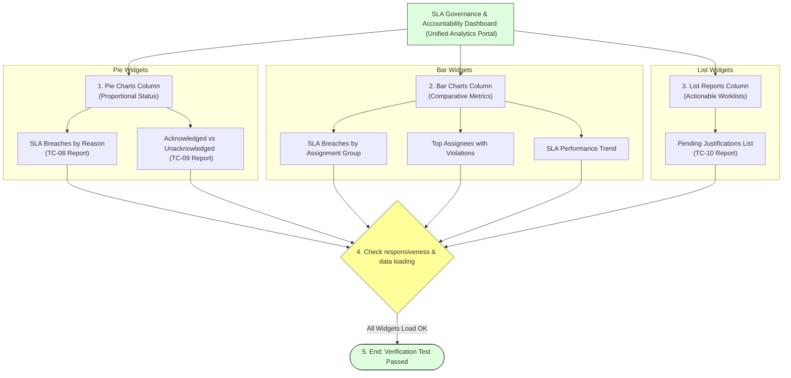

# Task 26: Dashboard – SLA Governance View (Test Case 11)

## Project Title

**Virtual Agent–Driven SLA Breach Awareness & Justification System**

---

# Introduction

The SLA Governance Dashboard provides a centralized view of SLA performance, breach analysis, justification tracking, and accountability metrics. This test case verifies that all dashboard widgets load successfully and display accurate information for monitoring SLA governance.

---

# Objective

Verify that the SLA Governance Dashboard loads successfully and displays all configured reports and widgets.

---

# Dashboard Consolidation & Widget Layout

---

# Test Case Information

| Property | Value |
|----------|-------|
| **Test Case ID** | TC-11 |
| **Test Case Name** | Dashboard – SLA Governance View |
| **Module** | Platform Analytics Dashboard |
| **Priority** | High |
| **Status** | Passed |

---

# Navigation

**Platform Analytics → Dashboards → SLA Governance & Accountability Dashboard**

---

# Preconditions

* Dashboard has been created.
* All SLA reports are added to the dashboard.
* Incident records exist.
* SLA data is available.
* Reports are generated successfully.

---

# Test Steps

### Step 1
Navigate to:
**Platform Analytics → Dashboards**

### Step 2
Open the dashboard:
**SLA Governance & Accountability Dashboard**

### Step 3
Verify that the dashboard loads without errors.

### Step 4
Validate that all report widgets are displayed.

### Step 5
Verify charts and reports show current SLA information.

---

# Expected Result

* Dashboard loads successfully.
* All widgets are visible.
* Charts display correct data.
* List reports load properly.
* Dashboard provides centralized SLA visibility.

---

# Actual Result

The SLA Governance Dashboard loaded successfully. All configured widgets, charts, and reports displayed correctly with current SLA information. The dashboard provides a centralized overview of SLA governance and accountability.

---

# Dashboard Widgets Inventory

The dashboard contains the following reports:

| Widget Name | Status |
| :--- | :--- |
| SLA Breaches by Reason | ✔ Loaded |
| SLA Breaches by Assignment Group | ✔ Loaded |
| Pending Justifications | ✔ Loaded |
| Acknowledged vs Unacknowledged Breaches | ✔ Loaded |
| Top Assignees with SLA Violations | ✔ Loaded |
| SLA Performance Trend | ✔ Loaded |

---

# Validation Checklist

| Validation | Status |
|------------|--------|
| Dashboard Opened | ✔ Passed |
| Pie Charts Loaded | ✔ Passed |
| Bar Charts Loaded | ✔ Passed |
| List Report Loaded | ✔ Passed |
| Performance Trend Loaded | ✔ Passed |
| Dashboard Responsive | ✔ Passed |

---

# Dashboard Components

### 1. Pie Charts
* SLA Breaches by Reason
* Acknowledged vs Unacknowledged Breaches

### 2. Bar Charts
* SLA Breaches by Assignment Group
* Top Assignees with SLA Violations
* SLA Performance Trend

### 3. List Report
* Pending Justifications

---

# Benefits

* **Centralized SLA monitoring:** View overall governance state on a single page.
* **Improved governance visibility:** Managers see critical alerts immediately.
* **Better decision-making:** Identify teams needing extra assistance.
* **Faster identification of SLA risks:** Tracks pending items before they breach.
* **Improved accountability:** Visualizes non-compliance metrics clearly.
* **Simplified reporting:** Avoids generating manual data sheets.

---

# Screenshots

### Figure 1 – SLA Governance Dashboard
*(Insert the dashboard screenshot provided.)*

---

### Figure 2 – Dashboard Widgets Overview
*(Optional screenshot showing the widgets arrangement.)*

---

### Figure 3 – Dashboard Reports
*(Optional screenshot showing report details.)*

---

# Outcome

The SLA Governance Dashboard successfully consolidated all SLA reports into a single interface, enabling administrators and managers to monitor SLA performance, breaches, pending justifications, and accountability in real time.

---

# Conclusion

Test Case 11 was successfully completed. The SLA Governance Dashboard loaded all configured widgets without errors and provided a comprehensive view of SLA governance, making it easier to monitor SLA compliance and take timely corrective actions.
