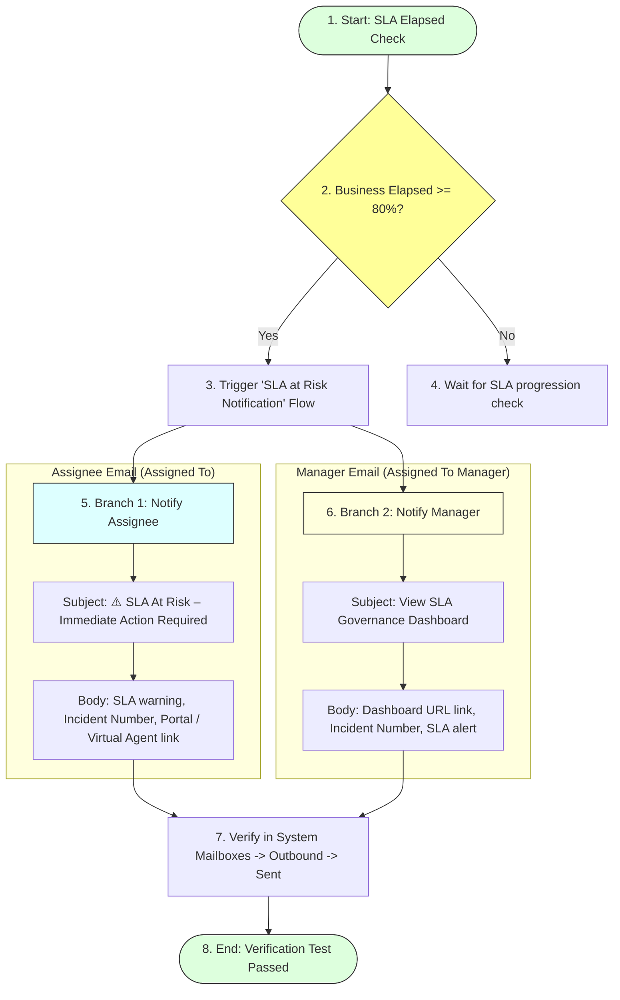

# Task 19: SLA Notification Email – Test Case 4

## Project Title

**Virtual Agent–Driven SLA Breach Awareness & Justification System**

---

# Introduction

This test case verifies that the configured Flow Designer automatically sends email notifications when an Incident reaches the SLA risk threshold (80% Business Elapsed). Notifications are sent to both the assigned support agent and the assigned manager to ensure timely action and improve SLA governance.

---

# Objective

Verify that email notifications are automatically sent to the Incident assignee and the assignee's manager when the Incident reaches the SLA At Risk threshold.

---

# SLA Risk Notification Flow

---

# Test Case Information

| Property | Value |
|----------|-------|
| **Test Case ID** | TC-04 |
| **Test Case Name** | SLA Notification Email |
| **Module** | Flow Designer / Notifications |
| **Priority** | High |
| **Status** | Passed |

---

# Navigation

**System Mailboxes → Outbound → Sent**
OR check the recipient email inbox in the ServiceNow Developer Instance.

---

# Preconditions

* Incident is created.
* SLA is attached and running.
* Business Elapsed Percentage reaches **80% or more**.
* Flow **SLA at Risk Notification** is active.
* Valid email addresses exist for the assignee and manager.

---

# Test Steps

### Step 1
Open an Incident with an active SLA.

### Step 2
Allow the SLA Business Elapsed Percentage to reach **80% or above** (simulated via time progression or manual elapsed field updates in test environment).

### Step 3
Refresh the Incident record.

### Step 4
Open:
**System Mailboxes → Outbound → Sent**
OR open the email inbox of the Incident assignee.

### Step 5
Verify the email sent to the **Assigned To** user.
Check:
* Recipient
* Subject
* SLA warning message
* Service Portal / Virtual Agent instructions

### Step 6
Verify the email sent to the **Assigned To Manager**.
Check:
* Recipient
* Subject
* Dashboard URL
* SLA governance message

---

# Expected Result

### Email 1 – Assigned To
* Email received successfully.
* Subject contains SLA warning.
* Incident Number included.
* Instructions to use Virtual Agent.
* Service Portal guidance provided.

### Email 2 – Manager
* Email received successfully.
* Dashboard link included.
* Incident Number displayed.
* Manager informed of SLA risk.

---

# Actual Result

Both email notifications were generated successfully after the SLA reached the configured threshold. The assignee received the SLA warning email, and the manager received the dashboard notification email containing the SLA Governance Dashboard link.

---

# Test Status

**PASS**

---

# Validation Checklist

| Validation | Status |
|------------|--------|
| Assignee Email Sent | ✔ Passed |
| Manager Email Sent | ✔ Passed |
| SLA Warning Included | ✔ Passed |
| Incident Number Included | ✔ Passed |
| Service Portal Instructions Included | ✔ Passed |
| Dashboard Link Included | ✔ Passed |

---

# Email Details

## Email 1 – Assigned To

| Property | Value |
|----------|-------|
| **Recipient** | Assigned To |
| **Subject** | ⚠️ SLA At Risk – Immediate Action Required |
| **Content** | SLA warning, Incident Number, Virtual Agent instructions |

---

## Email 2 – Assigned To Manager

| Property | Value |
|----------|-------|
| **Recipient** | Assigned To Manager |
| **Subject** | View SLA Governance Dashboard |
| **Content** | Dashboard URL, Incident Number, SLA notification |

---

# Screenshots

### Figure 1 – Email Received by Assigned To
*(Insert screenshot showing the SLA warning email received by the assigned support agent.)*

---

### Figure 2 – Email Received by Assigned To Manager
*(Insert screenshot showing the dashboard notification email received by the manager.)*

---

### Figure 3 – Outbound Email Log (Optional)
*(Insert screenshot showing successful email delivery from System Mailboxes.)*

---

# Benefits

* **Proactive SLA notification:** Warns agents before breaches happen.
* **Faster incident response:** Drives agents to prioritize critical work.
* **Improved SLA compliance:** Decreases standard breach rates.
* **Better management visibility:** Informs managers instantly of risky tasks.
* **Automated communication:** Eliminates manual warning emails.
* **Supports SLA governance:** Keeps teams aligned with service commitments.

---

# Outcome

The Flow Designer notification executed successfully when the SLA reached the defined threshold. Notification emails were delivered to both the assignee and the manager with the required SLA warning, Virtual Agent guidance, and dashboard information.

---

# Conclusion

Test Case 4 successfully validates the email notification process. The automated notifications ensure timely awareness of SLA risks and provide users and managers with the information needed to prevent SLA breaches and improve operational efficiency.
