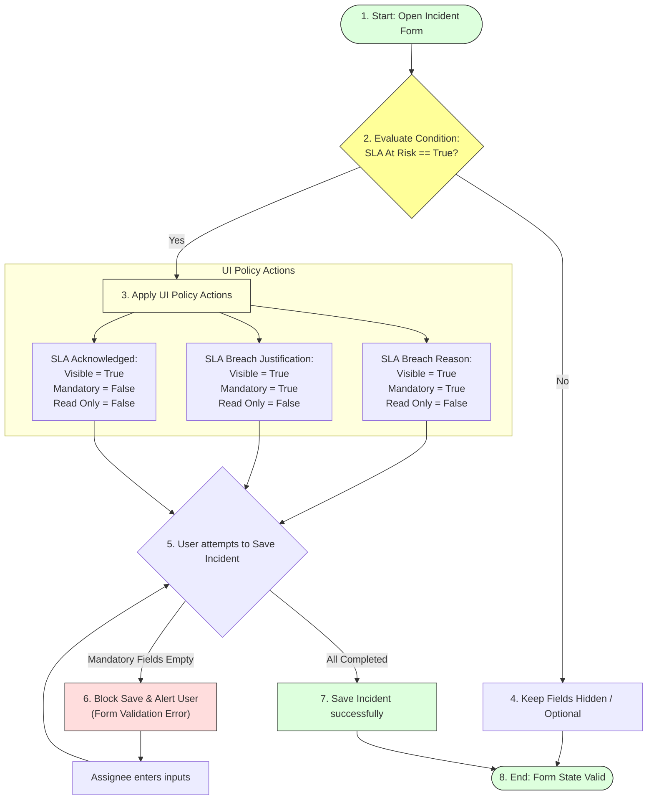

# Task 20: UI Policy – Assignee Access (Test Case 5)

## Project Title

**Virtual Agent–Driven SLA Breach Awareness & Justification System**

---

# Introduction

This test case validates that the UI Policy configured in ServiceNow works correctly when an Incident reaches the SLA risk threshold. Once the **SLA At Risk** field becomes **True**, the SLA-related fields should become visible, editable, and mandatory for the assignee.

---

# Objective

Verify that the configured UI Policy automatically makes the SLA-related fields editable, visible, and mandatory when the **SLA At Risk** field is set to **True**.

---

# UI Policy Validation logic Flow

---

# Test Case Information

| Property | Value |
|----------|-------|
| **Test Case ID** | TC-05 |
| **Test Case Name** | UI Policy – Assignee Access |
| **Module** | System UI – UI Policy |
| **Priority** | High |
| **Status** | Passed |

---

# Navigation

**Incident → Open Existing Incident**

---

# Preconditions

* Incident is created.
* SLA is attached.
* Business Elapsed Percentage is greater than or equal to **80%**.
* **SLA At Risk = True** (flag checked by Flow Designer).
* UI Policy is active.

---

# Test Steps

### Step 1
Open an Incident where **SLA At Risk = True**.

### Step 2
Verify the SLA-related fields displayed on the Incident form.

### Step 3
Check the following fields:
* SLA Breach Reason
* SLA Breach Justification
* SLA Acknowledged

### Step 4
Try saving the Incident without entering the mandatory fields.

### Step 5
Enter valid values for all required fields and save the Incident.

---

# Expected Result

* **SLA Breach Reason** is **Visible**, **Editable**, and **Mandatory**.
* **SLA Breach Justification** is **Visible**, **Editable**, and **Mandatory**.
* **SLA Acknowledged** is **Visible** and **Editable**.
* Incident cannot be saved until mandatory fields are completed.
* Incident saves successfully after entering the required values.

---

# Actual Result

The UI Policy executed successfully after **SLA At Risk** became **True**. The SLA Breach Reason and SLA Breach Justification fields became mandatory and editable, while the SLA Acknowledged field became editable. The Incident could only be saved after all mandatory information was provided.

---

# Test Status

**PASS**

---

# Validation Checklist

| Validation | Status |
|------------|--------|
| SLA At Risk = True | ✔ Passed |
| SLA Breach Reason Visible | ✔ Passed |
| SLA Breach Reason Mandatory | ✔ Passed |
| SLA Breach Reason Editable | ✔ Passed |
| SLA Breach Justification Visible | ✔ Passed |
| SLA Breach Justification Mandatory | ✔ Passed |
| SLA Breach Justification Editable | ✔ Passed |
| SLA Acknowledged Editable | ✔ Passed |
| Record Saved Successfully | ✔ Passed |

---

# Screenshots

### Figure 1 – Incident with SLA At Risk
*(Insert screenshot showing the Incident where SLA At Risk is checked.)*

---

### Figure 2 – UI Policy Applied
*(Insert the provided screenshot showing SLA Breach Reason, SLA Breach Justification, SLA Acknowledged, and SLA At Risk fields.)*

---

### Figure 3 – Mandatory Field Validation
*(Insert screenshot showing validation when mandatory fields are left empty.)*

---

### Figure 4 – Incident Saved Successfully
*(Insert screenshot after entering the required values and saving the Incident.)*

---

# Benefits

* **Ensures users provide justification:** Requires documentation before an SLA breach.
* **Improves accountability:** Direct link between support agent actions and records.
* **Maintains audit-ready records:** Keeps justification histories for compliance reviews.
* **Prevents incomplete updates:** SLA fields must be filled prior to resolution updates.
* **Supports SLA governance:** Promotes process discipline across support teams.

---

# Outcome

The UI Policy successfully enforced field visibility and mandatory validation when the Incident reached the SLA risk threshold. This ensures that assignees provide the required breach reason, justification, and acknowledgement before updating the Incident.

---

# Conclusion

Test Case 5 confirms that the UI Policy behaves as expected. SLA-related fields become mandatory and editable only when the Incident is at risk, ensuring accurate SLA governance and complete documentation of breach justifications.
