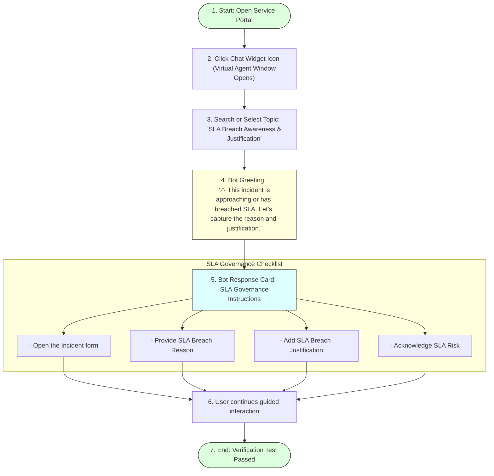

# Task 21: Virtual Agent Invocation – Test Case 6

## Project Title

**Virtual Agent–Driven SLA Breach Awareness & Justification System**

---

# Introduction

This test case validates that the ServiceNow Virtual Agent launches successfully from the Service Portal and guides users through the **SLA Breach Awareness & Justification** conversation. The Virtual Agent provides SLA governance instructions and helps users understand the actions required when an Incident is approaching an SLA breach.

---

# Objective

Verify that the Virtual Agent can be launched successfully and displays the configured SLA governance conversation.

---

# Virtual Agent Invocation Conversation Tree

---

# Test Case Information

| Property | Value |
|----------|-------|
| **Test Case ID** | TC-06 |
| **Test Case Name** | Virtual Agent Invocation |
| **Module** | Virtual Agent |
| **Priority** | High |
| **Status** | Passed |

---

# Navigation

**Service Portal → Virtual Agent**

---

# Preconditions

* ITSM Virtual Agent plugin is installed.
* Virtual Agent topic is published.
* User has the **itil** role.
* Service Portal is accessible.
* Topic **SLA Breach Awareness & Justification** is active.

---

# Test Steps

### Step 1
Open the **Service Portal**.

### Step 2
Click the **Virtual Agent (Chat)** icon.

### Step 3
Search for or select the topic:
**SLA Breach Awareness & Justification**

### Step 4
Start the conversation.

### Step 5
Verify that the greeting message is displayed.
Expected greeting:
> ⚠️ This incident is approaching or has breached SLA. Let's capture the reason and justification.

### Step 6
Continue the conversation.
Verify that the Virtual Agent displays SLA governance instructions.

---

# Expected Result

* Virtual Agent opens successfully.
* Topic **SLA Breach Awareness & Justification** is displayed.
* SLA warning message is shown.
* Governance instructions are displayed.
* User can continue the guided conversation.

---

# Actual Result

The Virtual Agent launched successfully from the Service Portal. The configured topic was available, and the greeting message along with SLA governance instructions were displayed correctly.

---

# Test Status

**PASS**

---

# Validation Checklist

| Validation | Status |
|------------|--------|
| Service Portal Opened | ✔ Passed |
| Virtual Agent Opened | ✔ Passed |
| Topic Displayed | ✔ Passed |
| Greeting Message Displayed | ✔ Passed |
| Governance Instructions Displayed | ✔ Passed |
| Conversation Started Successfully | ✔ Passed |

---

# Conversation Flow Details

### Greeting:
⚠️ This incident is approaching or has breached SLA.
Let's capture the reason and justification.

### Bot Response:
To comply with SLA governance:
* Open the Incident form
* Provide SLA Breach Reason
* Add SLA Breach Justification
* Acknowledge SLA Risk
These fields are mandatory before saving.

---

# Screenshots

### Figure 1 – Service Portal
*(Insert screenshot of the Service Portal home page.)*

---

### Figure 2 – Virtual Agent Opened
*(Insert screenshot showing the Virtual Agent chat window.)*

---

### Figure 3 – SLA Breach Awareness & Justification Topic
*(Insert screenshot showing the selected topic.)*

---

### Figure 4 – Greeting Message
*(Insert screenshot displaying the greeting message.)*

---

### Figure 5 – Governance Instructions
*(Insert screenshot showing the bot response with SLA governance instructions.)*

---

# Benefits

* **Provides conversational guidance:** Simplifies how agents navigate breach requirements.
* **Improves user experience:** Conversational AI feels premium compared to reading manuals.
* **Reduces manual follow-ups:** Automates notifications, cutting down administrative reminders.
* **Ensures SLA compliance:** Directly walks support agents through required fields.
* **Simplifies incident handling:** Unified chat experience inside the Service Portal.
* **Supports proactive SLA governance:** Prevents standard breach oversights.

---

# Outcome

The Virtual Agent successfully launched from the Service Portal and guided the user through the SLA governance process. The configured topic and conversational responses were displayed correctly, confirming successful Virtual Agent configuration.

---

# Conclusion

Test Case 6 successfully validates the Virtual Agent invocation process. Users can access the chatbot, receive SLA warnings, and follow guided governance instructions, improving SLA awareness and operational efficiency.
