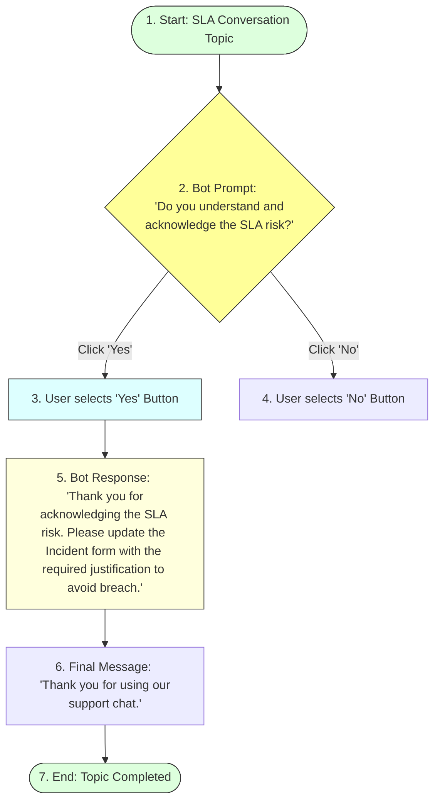

# Task 22: SLA Acknowledgement via Virtual Agent – Test Case 7

## Project Title

**Virtual Agent–Driven SLA Breach Awareness & Justification System**

---

# Introduction

This test case verifies that the Virtual Agent successfully captures the user's acknowledgement of an SLA risk. When the user selects **"Yes"**, the chatbot displays a confirmation message, confirming that the acknowledgement has been recorded and guiding the user to complete the required SLA justification.

---

# Objective

Verify that the Virtual Agent captures the user's SLA acknowledgement and displays a confirmation message.

---

# Virtual Agent SLA Acknowledgement Flow

---

# Test Case Information

| Property | Value |
|----------|-------|
| **Test Case ID** | TC-07 |
| **Test Case Name** | SLA Acknowledgement via Virtual Agent |
| **Module** | Virtual Agent |
| **Priority** | High |
| **Status** | Passed |

---

# Navigation

**Service Portal → Virtual Agent**

---

# Preconditions

* Service Portal is accessible.
* ITSM Virtual Agent plugin is installed.
* Virtual Agent topic is active.
* User has the **itil** role.
* SLA Breach Awareness & Justification topic is available.

---

# Test Steps

### Step 1
Open the Service Portal.

### Step 2
Launch the Virtual Agent.

### Step 3
Select the topic:
**SLA Breach Awareness & Justification**

### Step 4
Proceed through the conversation until the chatbot asks:
> **Do you understand and acknowledge the SLA risk?**

### Step 5
Click **"Yes"**.

### Step 6
Verify the confirmation message displayed by the Virtual Agent.

---

# Expected Result

* User selects **Yes**.
* Virtual Agent accepts the acknowledgement.
* Confirmation message is displayed.
* User is instructed to update the Incident with SLA justification.

---

# Actual Result

After selecting **Yes**, the Virtual Agent displayed the confirmation message and instructed the user to update the Incident form with the required SLA Breach Reason and SLA Breach Justification.

---

# Test Status

**PASS**

---

# Validation Checklist

| Validation | Status |
|------------|--------|
| Virtual Agent Started | ✔ Passed |
| SLA Topic Opened | ✔ Passed |
| SLA Risk Question Displayed | ✔ Passed |
| User Clicked "Yes" | ✔ Passed |
| Confirmation Message Displayed | ✔ Passed |
| Incident Update Instructions Displayed | ✔ Passed |

---

# Conversation Flow

### Bot Question:
**Do you understand and acknowledge the SLA risk?**

### User Response:
**Yes**

### Bot Confirmation:
Thank you for acknowledging the SLA risk.
Please update the Incident form with the required justification to avoid breach.

### Final Message:
Thank you for using our support chat.

---

# Screenshots

### Figure 1 – Service Portal
*(Insert screenshot showing the Service Portal.)*

---

### Figure 2 – Virtual Agent Conversation
*(Insert screenshot showing the SLA acknowledgement question.)*

---

### Figure 3 – User Clicks "Yes"
*(Insert screenshot showing the user selecting **Yes**.)*

---

### Figure 4 – Confirmation Message
*(Insert the provided screenshot showing the confirmation message after acknowledgement.)*

---

# Benefits

* **Captures user acknowledgement:** Direct record of agent agreement.
* **Improves SLA compliance:** Reminds agents to complete paperwork beforehand.
* **Ensures accountability:** Trackable conversation history.
* **Provides guided interaction:** Intuitive UI prompts.
* **Supports audit readiness:** Standardized responses.
* **Enhances user experience:** Conversational chat interface.

---

# Outcome

The Virtual Agent successfully captured the user's acknowledgement and displayed the expected confirmation message. The chatbot then instructed the user to complete the SLA justification on the Incident record.

---

# Conclusion

Test Case 7 successfully validates the SLA acknowledgement process through the Virtual Agent. The conversational workflow ensures that users acknowledge SLA risks and receive clear guidance for completing the required justification before an SLA breach occurs.
