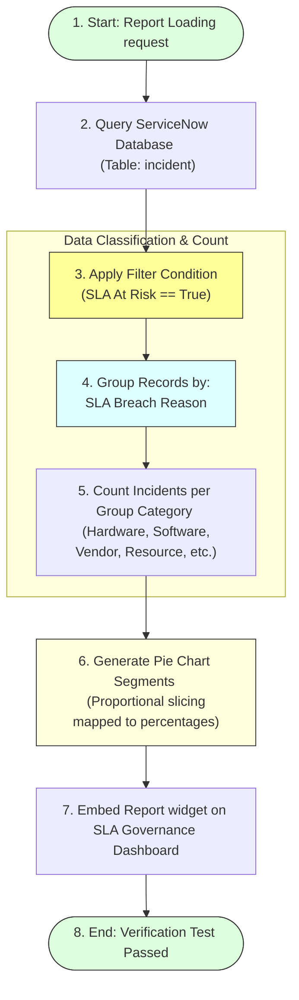

# Task 23: Reporting – SLA Breaches by Reason (Test Case 8)

## Project Title

**Virtual Agent–Driven SLA Breach Awareness & Justification System**

---

# Introduction

This test case verifies that the **SLA Breaches by Reason** report is generated successfully in ServiceNow. The report provides a visual representation of SLA breach reasons using a Pie Chart, enabling administrators and managers to identify the most common causes of SLA risks and improve service performance.

---

# Objective

Verify that the **SLA Breaches by Reason** report is displayed correctly as a Pie Chart grouped by **SLA Breach Reason**.

---

# Reporting & Analytical Aggregation Flow

---

# Test Case Information

| Property | Value |
|----------|-------|
| **Test Case ID** | TC-08 |
| **Test Case Name** | Reporting – SLA Breaches by Reason |
| **Module** | Platform Analytics / Reports |
| **Priority** | Medium |
| **Status** | Passed |

---

# Navigation

**Platform Analytics → Reports → SLA Breaches by Reason**

---

# Preconditions

* Incident records are available.
* SLA At Risk field is configured.
* SLA Breach Reason field contains values.
* Report has been created.
* Dashboard is accessible.

---

# Test Steps

### Step 1
Navigate to:
**Platform Analytics → Reports**

### Step 2
Open the report:
**SLA Breaches by Reason**

### Step 3
Verify the report visualization.

### Step 4
Confirm that the report is grouped by **SLA Breach Reason**.

### Step 5
Verify that only incidents where **SLA At Risk = True** are included.

---

# Expected Result

* Report loads successfully.
* Pie Chart is displayed.
* Records are grouped by **SLA Breach Reason**.
* Chart represents the distribution of SLA breach reasons.
* Data matches the Incident records.

---

# Actual Result

The report was generated successfully as a Pie Chart. Incidents were grouped by **SLA Breach Reason**, providing a clear visualization of the distribution of SLA breaches.

---

# Test Status

**PASS**

---

# Validation Checklist

| Validation | Status |
|------------|--------|
| Report Generated | ✔ Passed |
| Pie Chart Displayed | ✔ Passed |
| Grouped by SLA Breach Reason | ✔ Passed |
| SLA At Risk Filter Applied | ✔ Passed |
| Data Displayed Correctly | ✔ Passed |

---

# Report Configuration

| Property | Value |
|----------|-------|
| **Report Name** | SLA Breaches by Reason |
| **Table** | Incident (`incident`) |
| **Visualization** | Pie Chart |
| **Group By** | SLA Breach Reason |
| **Filter** | `SLA At Risk = True` |

---

# Screenshots

### Figure 1 – SLA Breaches by Reason Report
*(Insert the provided Pie Chart screenshot.)*

---

### Figure 2 – Report Configuration
*(Insert screenshot showing the report configuration page.)*

---

### Figure 3 – Dashboard View
*(Insert screenshot showing this report added to the dashboard.)*

---

# Benefits

* **Identifies major SLA breach reasons:** Highlights systematic operational bottlenecks.
* **Supports SLA governance:** Keeps leaders informed of SLA warning categories.
* **Helps improve service quality:** Enables targeted resource allocation (training, vendor audits).
* **Enables management reporting:** Clean executive visualization.
* **Provides visual analytics:** Quick analytical snapshot.
* **Assists in root cause analysis:** Drives structural improvements.

---

# Outcome

The SLA Breaches by Reason report successfully displayed breach data using a Pie Chart. The report accurately grouped incidents by SLA Breach Reason, making it easy to analyze and monitor SLA performance.

---

# Conclusion

Test Case 8 successfully validates the **SLA Breaches by Reason** report. The visualization provides meaningful insights into the distribution of SLA breach causes and supports effective SLA governance and operational decision-making.
