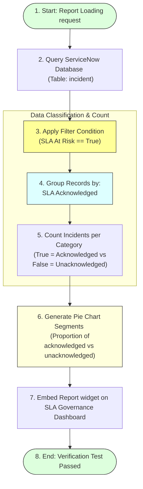

# Task 24: Reporting – Acknowledged vs Unacknowledged Breaches (Test Case 9)

## Project Title

**Virtual Agent–Driven SLA Breach Awareness & Justification System**

---

# Introduction

This test case validates the **Acknowledged vs Unacknowledged Breaches** report in ServiceNow. The report displays a Pie Chart showing the proportion of SLA breaches that have been acknowledged by users versus those that remain unacknowledged. This visualization helps administrators and managers monitor SLA accountability and identify incidents requiring user action.

---

# Objective

Verify that the **Acknowledged vs Unacknowledged Breaches** report is generated correctly and displays SLA acknowledgement status using a Pie Chart.

---

# Reporting & Acknowledgement Aggregation Flow

---

# Test Case Information

| Property | Value |
|----------|-------|
| **Test Case ID** | TC-09 |
| **Test Case Name** | Reporting – Acknowledged vs Unacknowledged Breaches |
| **Module** | Platform Analytics / Reports |
| **Priority** | Medium |
| **Status** | Passed |

---

# Navigation

**Platform Analytics → Reports → Acknowledged vs Unacknowledged Breaches**

---

# Preconditions

* Incident records exist.
* SLA Acknowledged field is configured.
* SLA At Risk field is available.
* Report is created.
* Dashboard is accessible.

---

# Test Steps

### Step 1
Navigate to:
**Platform Analytics → Reports**

### Step 2
Open the report:
**Acknowledged vs Unacknowledged Breaches**

### Step 3
Verify the Pie Chart visualization.

### Step 4
Confirm the report is grouped by **SLA Acknowledged**.

### Step 5
Verify only records with **SLA At Risk = True** are included.

---

# Expected Result

* Report opens successfully.
* Pie Chart is displayed.
* Records are grouped by **SLA Acknowledged**.
* Both acknowledged and unacknowledged incidents are represented.
* Data accurately reflects Incident records.

---

# Actual Result

The report was generated successfully and displayed a Pie Chart representing acknowledged and unacknowledged SLA breaches. The report accurately reflected the acknowledgement status of incidents with **SLA At Risk = True**.

---

# Test Status

**PASS**

---

# Validation Checklist

| Validation | Status |
|------------|--------|
| Report Generated | ✔ Passed |
| Pie Chart Displayed | ✔ Passed |
| Grouped by SLA Acknowledged | ✔ Passed |
| SLA At Risk Filter Applied | ✔ Passed |
| Data Displayed Correctly | ✔ Passed |

---

# Report Configuration

| Property | Value |
|----------|-------|
| **Report Name** | Acknowledged vs Unacknowledged Breaches |
| **Table** | Incident (`incident`) |
| **Visualization** | Pie Chart |
| **Group By** | SLA Acknowledged |
| **Filter** | `SLA At Risk = True` |

---

# Screenshots

### Figure 1 – Acknowledged vs Unacknowledged Breaches Report
*(Insert the provided Pie Chart screenshot.)*

---

### Figure 2 – Report Configuration
*(Insert screenshot showing the report configuration page.)*

---

### Figure 3 – Dashboard View
*(Insert screenshot showing this report added to the SLA Governance Dashboard.)*

---

# Benefits

* **Tracks SLA accountability:** Identifies which agents have accepted responsibilities.
* **Measures user acknowledgement compliance:** Provides statistical completion levels.
* **Improves SLA governance:** Enforces accountability procedures.
* **Supports management reporting:** Simplifies status reporting.
* **Identifies pending acknowledgements:** Flags unacknowledged high-risk tasks.
* **Enables proactive monitoring:** Pinpoints weak compliance zones.

---

# Outcome

The report successfully displayed the acknowledgement status of SLA breaches using a Pie Chart. It provided a clear visualization of acknowledged and unacknowledged incidents, supporting effective SLA monitoring and accountability.

---

# Conclusion

Test Case 9 successfully validates the **Acknowledged vs Unacknowledged Breaches** report. The report provides valuable insights into SLA acknowledgement compliance and helps managers monitor user accountability within the SLA governance process.
